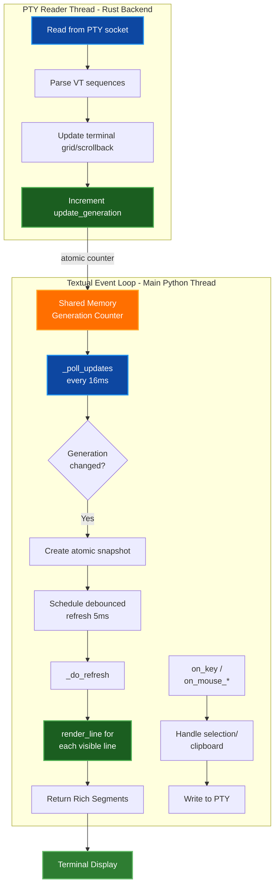
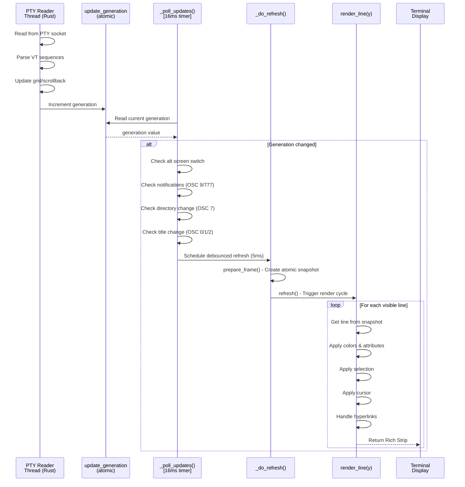
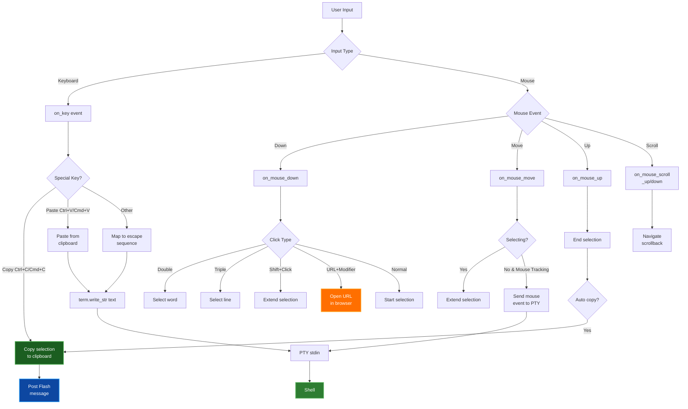
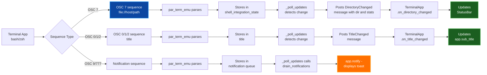
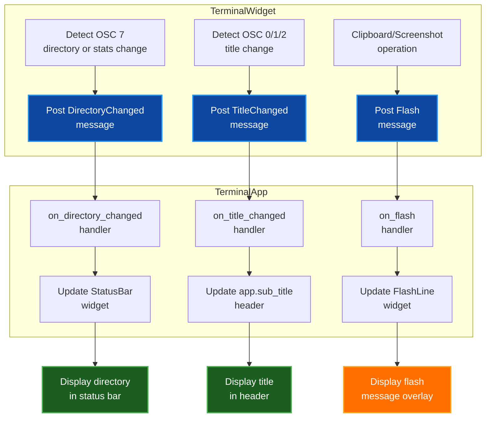
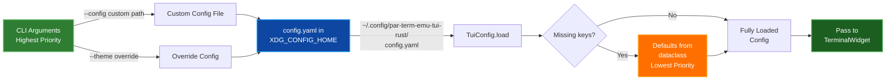
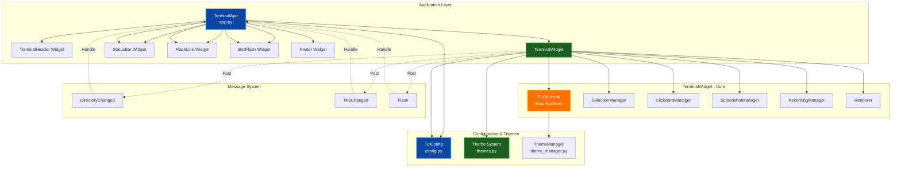

# PAR TERM EMU TUI RUST - Architecture Document

Comprehensive architecture documentation for the par-term-emu-tui-rust terminal user interface, detailing system design, components, data flows, and implementation patterns.

## Table of Contents
- [Overview](#overview)
- [Architecture Layers](#architecture-layers)
  - [Application Layer](#1-application-layer-terminalapp)
  - [Terminal Widget Layer](#2-terminal-widget-layer-terminalwidget)
  - [Rendering System](#3-rendering-system-renderer)
  - [Selection System](#4-selection-system-selectionmanager)
  - [Clipboard System](#5-clipboard-system-clipboardmanager)
  - [Screenshot System](#6-screenshot-system-screenshotmanager)
  - [Recording System](#7-recording-system-recordingmanager)
  - [Theme System](#8-theme-system-themespy--theme_managerpy)
  - [Backend Controls](#9-backend-controls-backend_controlspy)
  - [Configuration System](#10-configuration-system-tuiconfig)
  - [Message System](#11-message-system-messagespy)
  - [Supporting Widgets](#12-supporting-widgets)
- [Data Flow Diagrams](#data-flow-diagrams)
  - [Update/Render Flow](#updaterender-flow)
  - [Input/Write Flow](#inputwrite-flow)
  - [Shell Integration Flow](#shell-integration-flow)
  - [Message Flow Architecture](#message-flow-architecture)
- [Key Design Patterns](#key-design-patterns)
- [Threading & Concurrency](#threading--concurrency)
- [Performance Characteristics](#performance-characteristics)
- [Extension Points](#extension-points)
- [Key Features Implementation](#key-features-implementation)
- [Configuration Loading Chain](#configuration-loading-chain)
- [Debugging Infrastructure](#debugging-infrastructure)
- [Technology Stack](#technology-stack)
- [Conclusion](#conclusion)
- [Related Documentation](#related-documentation)

---

## Overview

**par-term-emu-tui-rust** is a Textual-based terminal user interface (TUI) that wraps the **par-term-emu-core-rust** terminal emulator library. It provides an interactive shell environment within a Python TUI framework, with advanced features including text selection, clipboard management, themes, screenshots, and shell integration.

**Key Technologies:**
- Python 3.12+ (requires >=3.12)
- Textual (TUI framework)
- par-term-emu-core-rust (Rust terminal emulator backend)
- PyYAML (configuration management)
- xdg-base-dirs (XDG directory compliance)
- pyperclip (cross-platform clipboard)

See `pyproject.toml` for current dependency versions.

**Project Structure:**
```
par-term-emu-tui-rust/
├── src/par_term_emu_tui_rust/
│   ├── app.py                          # Main Textual application
│   ├── config.py                       # Configuration management (TuiConfig)
│   ├── messages.py                     # Custom Textual messages
│   ├── themes.py                       # Color theme definitions (12 built-in themes)
│   ├── utils.py                        # Utility functions
│   ├── installer.py                    # Installation script handler
│   ├── dialogs/
│   │   ├── __init__.py
│   │   ├── config_edit_dialog.py       # Config editor dialog (deprecated)
│   │   └── config_screen.py            # Configuration screen with tabbed interface
│   ├── terminal_widget/
│   │   ├── __init__.py
│   │   ├── terminal_widget.py          # Main TerminalWidget class
│   │   ├── rendering.py                # Renderer class for line-based rendering
│   │   ├── selection.py                # SelectionManager for text selection
│   │   ├── clipboard.py                # ClipboardManager for clipboard ops
│   │   ├── screenshot.py               # ScreenshotManager for screenshot capture
│   │   ├── recording.py                # RecordingManager for session recording
│   │   ├── theme_manager.py            # Apply themes to terminal
│   │   └── backend_controls.py         # Backend configuration helpers
│   └── widgets/
│       ├── __init__.py
│       ├── terminal_header.py          # TerminalHeader widget (custom header with bell)
│       ├── status_bar.py               # StatusBar widget (directory display)
│       ├── flash_line.py               # FlashLine widget (flash messages)
│       └── bell_flash.py               # BellFlash widget (visual bell overlay)
├── tests/
│   └── test_keyboard_protocol.py
├── pyproject.toml
├── README.md
├── docs/
│   ├── DEBUG.md                        # Comprehensive debugging guide
│   ├── CONFIG_REFERENCE.md             # Configuration options reference
│   ├── DOCUMENTATION_STYLE_GUIDE.md    # Documentation standards
│   ├── ARCHITECTURE.md                 # This file
│   ├── KEYBOARD_PROTOCOL.md            # KITTY keyboard protocol documentation
│   ├── FEATURES.md                     # Feature descriptions
│   ├── KEY_BINDINGS.md                 # Keyboard shortcuts
│   ├── USAGE.md                        # Command-line usage
│   ├── QUICK_START.md                  # Getting started
│   ├── INSTALLATION.md                 # Installation guide
│   ├── TROUBLESHOOTING.md              # Common issues
│   ├── THEMES.md                       # Theme documentation
│   └── SCREENSHOTS.md                  # Screenshot gallery
└── Makefile
```

---

## Architecture Layers

### 1. Application Layer (`TerminalApp`)

**File:** `app.py`

The top-level Textual application that manages the overall UI structure and application lifecycle.

**Key Responsibilities:**
- Compose UI hierarchy (TerminalHeader, TerminalWidget, StatusBar, FlashLine, BellFlash, Footer)
- Handle application-level key bindings (Ctrl+Shift+Q to quit, Alt+Ctrl+Shift+C to edit config)
- Manage screenshot capture and auto-quit timers
- Process custom messages from child widgets (Directory changes, title changes, flash notifications)
- Parse and handle command-line arguments
- Manage theme operations (list, export, apply themes)
- Disable default Ctrl+Q and Ctrl+C bindings to let them pass to the terminal

**Key Methods:**
- `__init__()` - Initialize with optional shell command, shell path, config, and debug settings
- `compose()` - Create child widgets (TerminalHeader, TerminalWidget, StatusBar, FlashLine, BellFlash, Footer)
- `on_mount()` - Schedule screenshot and auto-quit timers
- `_take_screenshot()` - Capture terminal buffer to file (PNG/JPEG/SVG/HTML/BMP)
- `_auto_quit()` - Exit application after delay
- `on_flash()` - Handle Flash messages from child widgets
- `on_directory_changed()` - Handle OSC 7 directory change messages
- `on_title_changed()` - Handle OSC 0/1/2 title change messages
- `action_edit_config()` - Open config editor dialog
- `main()` - Entry point with full CLI argument parsing

**Configuration Integration:**
- Loads `TuiConfig` from YAML (XDG_CONFIG_HOME)
- Passes config to TerminalWidget
- Respects theme override from CLI (`--theme` flag)

**Message Flow:**
- Receives `DirectoryChanged` messages (directory + optional stats summary) → updates StatusBar
- Receives `TitleChanged` messages → updates app sub_title
- Receives `Flash` messages → displays via FlashLine widget

---

### 2. Terminal Widget Layer (`TerminalWidget`)

**File:** `terminal_widget/terminal_widget.py`

The core custom Textual widget that wraps `par_term_emu_core_rust.PtyTerminal` and provides interactive shell access with advanced terminal features.

**Inheritance:** `Widget` with `can_focus=True`

**Key Responsibilities:**
- Wrap PtyTerminal (Rust terminal emulator backend)
- Manage PTY lifecycle (spawn shell, write input, kill process)
- Poll for PTY updates using generation tracking
- Render terminal content using Textual's Line API
- Handle all user input (keyboard and mouse)
- Manage text selection and clipboard
- Implement scrollback buffer navigation
- Apply themes and configure cursor styles
- Handle shell integration (OSC 7, OSC 0/1/2)
- Manage cursor blinking

**Threading Model:**



**Generation Tracking Pattern:**

The widget uses atomic generation counters to detect when PTY content has changed:

```python
# In PTY reader thread (Rust):
self.term.update_generation()  # Increments on each update

# In Textual event loop:
current_gen = self.term.update_generation()
if self.term.has_updates_since(self.last_update_generation):
    self.last_update_generation = current_gen
    self.refresh()  # Schedule render
```

**Key Attributes:**

```python
# Terminal dimensions (reactive)
terminal_cols: int = 80
terminal_rows: int = 24

# PTY instance
term: PtyTerminal  # Rust terminal emulator

# State tracking
_scroll_offset: int          # Lines scrolled up from bottom (0 = at bottom)
_at_bottom: bool             # True if viewing live output
_rendering_ready: bool       # False until widget has non-zero size
_was_alt_screen: bool        # Tracks primary ↔ alternate screen switching
_cursor_blink_visible: bool  # Current blink state

# Shell integration state
_last_known_directory: str   # From OSC 7
_last_known_title: str       # From OSC 0/1/2

# Generation tracking
last_update_generation: int  # Last PTY generation we processed
render_generation: int       # Generation being rendered (atomic snapshot)

# Managers (composition)
selection: SelectionManager
clipboard: ClipboardManager
screenshot: ScreenshotManager
recording: RecordingManager
renderer: Renderer
```

**Key Methods:**

```python
# Lifecycle
on_mount()                    # Spawn shell, apply theme, start polling
on_unmount()                  # Stop polling, kill shell
on_resize(event)              # Resize PTY and widget on window resize

# Update polling
_poll_updates()               # Check for PTY updates (called every 16ms)
_do_refresh()                 # Execute debounced refresh

# Rendering
render_line(y) -> Strip       # Render one line of terminal content

# Input handling
async on_key(event)           # Handle keyboard input
async on_mouse_down(event)    # Handle mouse press (selection, URL clicks)
async on_mouse_move(event)    # Handle mouse move (selection drag)
async on_mouse_up(event)      # Handle mouse release
async on_mouse_scroll_*()     # Handle scrollback navigation

# Actions (key bindings)
action_copy_selection()       # Copy selected text to clipboard
action_paste_clipboard()      # Paste from clipboard to PTY
action_save_screenshot()      # Save screenshot
action_scroll_up/down/top/bottom()  # Navigate scrollback

# PTY communication
_send_shell_command()         # Send scheduled command after 1s delay
_send_mouse_event()           # Send SGR mouse events to PTY
_toggle_cursor_blink()        # Toggle cursor visibility

# Helpers
_get_cell_metrics()           # Get pixel metrics from environment
```

**Configuration Integration:**

The widget accepts a `TuiConfig` object and respects 55 configuration options including scrollback_lines, cursor settings, clipboard and clipboard-sync behavior, mouse handling, security options, theme selection, backend notification controls, screenshots, recording, URL handling, visual bell, keyboard protocol (KITTY), and search highlighting.

**Message Production:**

- Posts `DirectoryChanged(directory, stats_summary)` when OSC 7 cwd changes or shell stats change
- Posts `TitleChanged(title)` when OSC 0/1/2 title changes
- Posts `Flash(content, style, duration)` for notifications

**Key Bindings:**

```
Ctrl+Shift+C        Copy selection
Ctrl+Shift+V        Paste from clipboard
Ctrl+Shift+S        Save screenshot
Ctrl+Shift+PageUp   Scroll up one page
Ctrl+Shift+PageDown Scroll down one page
Shift+Home          Scroll to top
Shift+End           Scroll to bottom
```

---

### 3. Rendering System (`Renderer`)

**File:** `terminal_widget/rendering.py`

Handles efficient line-by-line rendering of terminal content to Rich Segments, with support for colors, text attributes, selections, cursor, hyperlinks, and inline graphics (Sixel, Kitty, iTerm2 protocols).

**Key Responsibilities:**
- Create atomic frame snapshots from terminal state
- Pre-fetch all lines from snapshot (optimization)
- Render each line with colors, attributes, selections, cursor, hyperlinks
- Handle wide characters (CJK)
- Render inline graphics using Unicode half-block technique
- Integrate graphics with scrollback (graphics scroll with text)
- Cache color conversions and style objects

**Key Methods:**

```python
def prepare_frame(widget_id: str)
    # Create atomic snapshot of terminal state
    # Pre-fetch all lines to avoid per-line cloning
    # Clear hyperlink cache for new frame

def render_line(y, widget_id, widget_size, rendering_ready) -> Strip
    # Render a single line using the prepared frame snapshot
    # Apply selection highlighting
    # Apply cursor if on this line
    # Apply hyperlink styling
    # Overlay inline graphics (Sixel/Kitty/iTerm2)
    # Handle scrollback graphics integration
    # Return Rich Strip with Segments

def _render_graphic_line(graphic, row, term_cols) -> list[Segment]
    # Render graphics using Unicode half-blocks (▀ U+2580)
    # Achieves 2:1 vertical compression
    # Top pixel = foreground color (top half)
    # Bottom pixel = background color (bottom half)
    # Supports alpha channel transparency
```

**Optimization Techniques:**

- **LRU Cache (1024)** for `_rgb_to_hex()` - avoids repeated string formatting
- **LRU Cache (512)** for `_create_style()` - reuses Style objects
- **Pre-fetch all lines** in `prepare_frame()` - reduces Rust→Python FFI calls
- **Frame-level snapshot** - prevents stale rendering during alternate screen switches
- **Hyperlink cache** - per-frame cache of detected links

**Color Handling:**

```python
def _rgb_to_hex(r: int, g: int, b: int) -> str
    # Convert RGB to "#rrggbb" hex string (cached)

def _create_style(...) -> Style
    # Create Rich Style with color, bgcolor, bold, italic, etc. (cached)
```

**Selection Rendering:**

When a selection exists (`selection.start` and `selection.end`), the renderer highlights the selected region with:
- Selection background color
- Selection text color
- Spans multiple lines if needed

---

### 4. Selection System (`SelectionManager`)

**File:** `terminal_widget/selection.py`

Manages text selection state and operations for the terminal widget.

**Key Responsibilities:**
- Track selection start/end positions (col, row)
- Detect double-click (word selection) and triple-click (line selection)
- Support drag-to-extend for word and line selections
- Handle shift+click for character-based selection
- Maintain anchor point during multi-click drag operations
- Provide selected text to clipboard manager
- Clear selection on input

**Selection Modes:**

```python
class SelectionMode(Enum):
    NORMAL = "normal"  # Character-by-character selection
    WORD = "word"      # Word-based selection (double-click)
    LINE = "line"      # Line-based selection (triple-click)
```

**Key Methods:**

```python
def __init__(term, config, get_terminal_cols)
def clear()
def select_word_at(col, row, frame_snapshot)
def select_line_at(row, frame_snapshot)
def extend_line_selection_to(row, frame_snapshot)
def is_cell_selected(col, row) -> bool
def get_selected_text() -> str
```

**Selection State:**

```python
self.start: tuple[int, int] | None  # (col, row) or None
self.end: tuple[int, int] | None    # (col, row) or None
self.selecting: bool                # True during mouse drag
self.selection_mode: SelectionMode  # Current selection mode
self.anchor_row: int | None         # Original row for line/word selection dragging
```

**Drag-to-Extend Behavior:**

- **Double-click + drag**: Extends selection by words (future enhancement)
- **Triple-click + drag**: Extends selection by full lines
  - Dragging upward: Updates `start`, keeps `end` at anchor line
  - Dragging downward: Keeps `start` at anchor line, updates `end`
  - Dragging back to anchor: Resets to anchor line only
  - Respects `triple_click_selects_wrapped_lines` setting

**Word Boundary Detection:**

Uses terminal's native `get_word_at(col, row, word_characters)` method which respects the configured `word_characters` setting (default: `"/-+\\~_."`).

---

### 5. Clipboard System (`ClipboardManager`)

**File:** `terminal_widget/clipboard.py`

Manages clipboard operations with cross-platform support.

**Key Responsibilities:**
- Copy selected text to system clipboard
- Handle trailing newline option
- Copy to X11 PRIMARY selection on Linux (for middle-click paste)
- Provide feedback on success/failure

**Key Methods:**

```python
def copy_to_clipboard(text, to_primary=True) -> tuple[bool, str | None]
    # Copy using pyperclip (Windows/macOS/Linux)
    # Also copy to PRIMARY on Linux if requested

def _copy_to_primary(text)
    # Linux-only: copy to X11 PRIMARY selection
    # Uses xclip or xsel
```

**Cross-Platform Support:**
- **Windows:** win32clipboard
- **macOS:** pbcopy
- **Linux:** xclip/xsel (with fallback)
- pyperclip handles all abstraction

---

### 6. Screenshot System (`ScreenshotManager`)

**File:** `terminal_widget/screenshot.py`

Manages screenshot capture with smart directory detection and multiple format support.

**Key Responsibilities:**
- Determine save directory (config → OSC 7 cwd → XDG_PICTURES_DIR → home)
- Capture terminal buffer in multiple formats
- Generate timestamped filenames
- Notify user of success/failure

**Supported Formats:**
- PNG (lossless, default)
- JPEG (lossy, smaller file size)
- BMP (uncompressed)
- SVG (vector, infinitely scalable)
- HTML (full document with inline styles)

**Key Methods:**

```python
def get_directory() -> str
    # Smart directory detection with fallback chain

def capture_screenshot(format) -> str
    # Capture to file, return path
```

---

### 7. Recording System (`RecordingManager`)

**File:** `terminal_widget/recording.py`

Manages terminal session recording with support for multiple output formats.

**Key Responsibilities:**
- Start and stop terminal session recording
- Determine save directory (config → OSC 7 cwd → XDG_VIDEOS_DIR → home)
- Export recordings in multiple formats
- Generate timestamped filenames with customizable titles
- Notify user of success/failure

**Supported Formats:**
- asciicast (asciinema v2 format, default - playback with asciinema)
- json (JSON export with full session data)

**Key Methods:**

```python
def start() -> tuple[bool, str | None]
    # Start recording session with timestamped title

def stop() -> tuple[bool, str | None]
    # Stop recording and optionally export

def export_to_file(format) -> str
    # Export recording to file, return path

def is_recording() -> bool
    # Check if currently recording
```

---

### 8. Theme System (`themes.py` + `theme_manager.py`)

**File:** `themes.py`

Defines the `Theme` dataclass and 12 built-in color themes compatible with iTerm2.

**Theme Components:**

```python
@dataclass
class Theme:
    name: str
    palette: list[str]         # 16 ANSI colors (hex)
    background: str            # Default background
    foreground: str            # Default foreground
    cursor: str                # Cursor color
    cursor_text: str           # Text color under cursor
    selection: str             # Selection background
    selection_text: str        # Selection text color
    link: str                  # Hyperlink color
    bold: str                  # Bold text color
    cursor_guide: str          # Vertical cursor guide
    underline: str             # Underline color
    badge: str                 # Badge color
    match: str                 # Search match highlight
```

**Built-in Themes:**
1. `dark-background` (default in config.py)
2. `high-contrast`
3. `light-background`
4. `pastel-dark`
5. `regular`
6. `smoooooth`
7. `solarized`
8. `solarized-dark`
9. `solarized-light`
10. `iterm2-dark` (DEFAULT_THEME in themes.py)
11. `tango-dark`
12. `tango-light`

Total: 12 built-in themes

Custom themes can be created in `~/.config/par-term-emu-tui-rust/themes/`

**File:** `terminal_widget/theme_manager.py`

Applies themes to the terminal instance.

**Key Functions:**

```python
def apply_theme(term: PtyTerminal, config: TuiConfig)
    # Set ANSI palette (0-15)
    # Set default colors (fg, bg)
    # Set cursor colors
    # Set selection colors
    # Set link/bold/underline/badge/match colors

def apply_cursor_style(term: PtyTerminal, config: TuiConfig)
    # Map config string to CursorStyle enum
    # Apply to terminal

def parse_color(color_hex: str) -> tuple[int, int, int]
    # Convert "#rrggbb" to RGB tuple
```

---

### 9. Backend Controls (`backend_controls.py`)

**File:** `terminal_widget/backend_controls.py`

Helper module that bridges TUI configuration settings to backend runtime options.

**Key Responsibilities:**
- Apply notification configuration to backend (bell settings, activity/silence thresholds)
- Configure clipboard synchronization limits
- Safe method invocation with fallback for missing backend features

**Key Functions:**

```python
def apply_notification_settings(term: PtyTerminal, config: TuiConfig)
    # Configure notification preferences and buffer limits
    # Sets bell_desktop, bell_sound, bell_visual
    # Sets activity/silence thresholds and enabled state
    # Sets max_notifications buffer size

def apply_clipboard_limits(term: PtyTerminal, config: TuiConfig)
    # Apply clipboard event buffer limits
    # Sets max_clipboard_sync_events and max_clipboard_event_bytes

def _safe_call(method_name: str, term: PtyTerminal, *args, **kwargs)
    # Safely invoke backend method if it exists
    # Ignores missing attributes for backwards compatibility
```

**Integration:**

Called from `TerminalWidget.on_mount()` after terminal initialization to configure backend behavior based on TuiConfig settings.

---

### 10. Configuration System (`TuiConfig`)

**File:** `config.py`

Manages application configuration with YAML persistence and XDG directory compliance.

**Key Responsibilities:**
- Define configuration schema as Python dataclass
- Load/save from/to YAML files
- Use XDG_CONFIG_HOME (~/.config/)
- Provide sensible defaults
- Validate configuration on load

**Configuration Storage:**

```
~/.config/par-term-emu-tui-rust/config.yaml
```

**Configuration Options (55 total):**

**Selection & Clipboard:**
- `auto_copy_selection` - Copy on selection complete (default: true)
- `keep_selection_after_copy` - Keep visible after copy (default: true)
- `expose_system_clipboard` - Allow apps to read clipboard (default: true)
- `copy_trailing_newline` - Add newline when copying (default: false)
- `word_characters` - Word boundary chars (default: `"/-+\\~_."`)
- `triple_click_selects_wrapped_lines` - Follow wrapping (default: true)

**Scrollback & Cursor:**
- `scrollback_lines` - Keep N lines (0=unlimited up to max) (default: 10000)
- `max_scrollback_lines` - Safety limit (default: 100000)
- `cursor_blink_enabled` - Enable blinking (default: false)
- `cursor_blink_rate` - Interval in seconds (default: 0.5)
- `cursor_style` - Visual style (default: `"blinking_block"`)

**Paste:**
- `paste_chunk_size` - Chunk size in bytes (0=no chunking) (default: 0)
- `paste_chunk_delay_ms` - Delay between chunks (default: 10)
- `paste_warn_size` - Warn before pasting > N bytes (default: 100000)

**Mouse & Focus:**
- `focus_follows_mouse` - Auto-focus on hover (default: false)
- `middle_click_paste` - Paste on middle click (default: true)
- `mouse_wheel_scroll_lines` - Lines per wheel tick (default: 3)

**Security:**
- `disable_insecure_sequences` - Filter risky sequences (default: false)
- `accept_osc7` - Allow directory tracking via OSC 7 (default: true)

**Theme & Appearance:**
- `theme` - Theme name (default: `"dark-background"`)
- `show_status_bar` - Show status bar (default: true)

**Notifications:**
- `show_notifications` - Display OSC 9/777 toasts (default: true)
- `notification_timeout` - Toast duration seconds (default: 5)

**Screenshots:**
- `screenshot_directory` - Save directory (default: auto-detect)
- `screenshot_format` - File format (default: `"png"`)
- `open_screenshot_after_capture` - Auto-open viewer (default: false)

**Hyperlinks & URLs:**
- `clickable_urls` - Enable URL clicking (default: true)
- `link_color` - RGB tuple (default: `(100, 150, 255)`)
- `url_modifier` - Required modifier (default: `"ctrl"`)
- `allowed_url_schemes` - List of allowed URL schemes (default: `["http", "https", "ftp", "ftps", "file", "mailto"]`)
- `warn_on_unknown_url_scheme` - Warn when blocking unsupported schemes (default: true)

**Theme & Appearance (continued):**
- `bold_brightening` - Use bright ANSI colors (8-15) for bold text with normal colors (0-7) (default: false)
- `minimum_contrast` - Minimum contrast adjustment for live terminal display, 0.0-1.0 (default: 0.5)
- `faint_text_alpha` - Alpha multiplier for faint/dim text, 0.0-1.0 (default: 0.5)

**Screenshots (continued):**
- `screenshot_minimum_contrast` - Minimum contrast adjustment for screenshots, 0.0-1.0 (default: inherit `minimum_contrast`)

**Search & Highlighting:**
- `search_match_color` - RGB tuple for search match highlights (default: `(255, 255, 0)`)

**Visual Bell:**
- `visual_bell_enabled` - Enable visual bell indicator in header (default: true)

**Keyboard Protocol (KITTY):**
- `keyboard_protocol_enabled` - Enable KITTY keyboard protocol for embedded apps (default: false)
- `keyboard_protocol_flags` - KITTY protocol feature flags, bitwise OR combination (default: 1)
- `keyboard_protocol_auto_detect` - Auto-detect and enable when apps request protocol (default: false)

**Shell Behavior:**
- `exit_on_shell_exit` - Exit TUI when shell exits (default: true)

**Key Methods:**

```python
@classmethod
def load(config_path=None) -> TuiConfig
    # Load from YAML, use defaults for missing keys

def save(config_path=None)
    # Save to YAML

@staticmethod
def default_config_path() -> Path
    # Return XDG_CONFIG_HOME/par-term-emu-tui-rust/config.yaml

def to_dict() -> dict[str, Any]
    # Convert to dictionary
```

---

### 11. Message System (`messages.py`)

**File:** `messages.py`

Custom Textual message types for inter-widget communication.

**Message Types:**

```python
@dataclass
class Flash(Message):
    """Request a transient flash message.

    Args:
        content: Message content
        style: Semantic style (default, warning, success, error)
        duration: Display duration seconds (or None for default)
    """
    content: str | Content
    style: Literal["default", "warning", "success", "error"]
    duration: float | None = None


@dataclass
class DirectoryChanged(Message):
    """Terminal directory changed via OSC 7 (with optional stats summary)."""

    directory: str
    stats_summary: str | None = None


@dataclass
class TitleChanged(Message):
    """Terminal title changed via OSC 0/1/2.

    Args:
        title: The new title
    """
    title: str
```

---

### 12. Supporting Widgets

#### TerminalHeader (`widgets/terminal_header.py`)

Custom header widget that displays a bell icon when terminal bell is triggered.

**Key Features:**
- Extends Textual's Header widget
- Shows bell icon (🔔) in sub-title when bell event detected
- Bell disappears on user keyboard/mouse input
- Reactive bell_active boolean

**Key Methods:**

```python
def show_bell()
    # Show bell icon in header sub-title

def hide_bell()
    # Hide bell icon and restore original sub-title
```

#### StatusBar (`widgets/status_bar.py`)

Displays information at the bottom of the TUI (directory from OSC 7).

**CSS Classes:**
- `.status_bar.-default`
- `.status_bar.-success`
- `.status_bar.-warning`
- `.status_bar.-error`

**Key Methods:**

```python
def update_content(content, style="default")
    # Update display with styled content
```

#### FlashLine (`widgets/flash_line.py`)

Overlay widget for transient flash messages (notifications, clipboard feedback).

**CSS:**
- Position: top of screen as overlay
- Visibility: initially hidden
- Auto-hide after duration

**Key Methods:**

```python
def flash(content, duration=None, style="default")
    # Flash message for specified duration
    # Auto-hide after timeout
```

#### BellFlash (`widgets/bell_flash.py`)

A 3x3 bell icon overlay widget that displays in the center of the screen when the terminal receives a bell character (BEL/\x07).

**Key Features:**
- 4-wide by 3-high widget with round border
- Displays bell icon (🔔) for 0.25 seconds
- Centered on screen as overlay
- Warning color scheme

**Key Methods:**

```python
def flash(duration=0.25)
    # Flash bell icon for specified duration
    # Auto-hide after timeout
```

---

## Data Flow Diagrams

### Update/Render Flow



### Input/Write Flow



### Shell Integration Flow



### Message Flow Architecture



---

## Key Design Patterns

### 1. Atomic Snapshot Pattern

The renderer uses atomic snapshots to prevent race conditions during rendering:

```python
# In _poll_updates():
self.renderer.prepare_frame(widget_id)  # Creates atomic snapshot

# Later, in render_line():
# All line renders use the same snapshot
# No risk of alternate screen switch happening mid-render
```

**Why?** Without snapshots, if the PTY switches screens between render_line(0) and render_line(23), different lines could come from different screen buffers (corruption).

### 2. Generation Tracking Pattern

Uses atomic counters to detect when content has changed:

```python
current_gen = self.term.update_generation()
if self.term.has_updates_since(self.last_update_generation):
    # Content changed, need to refresh
    self.refresh()
```

**Why?** Avoids polling the entire screen on every timer tick. Only refreshes when content actually changed.

### 3. Debounced Refresh Pattern

Batches rapid successive updates:

```python
# In _poll_updates():
if self._refresh_timer is not None:
    self._refresh_timer.stop()  # Cancel previous timer

# Schedule refresh after 5ms delay
self._refresh_timer = self.set_timer(0.005, self._do_refresh)
```

**Why?** Prevents partial rendering during scrollbar drags and other rapid updates. Multiple generation changes coalesce into one render cycle.

### 4. Callable Dependency Pattern

Managers receive callables to access widget state:

```python
self.renderer = Renderer(
    term=self.term,
    get_terminal_cols=lambda: self.terminal_cols,
    get_selection_start=lambda: self.selection.start,
    get_cursor_blink_visible=lambda: self._cursor_blink_visible,
)
```

**Why?** Avoids circular dependencies and late binding of state. Renderer always reads current state when rendering.

### 5. Manager Composition Pattern

Feature-specific functionality isolated in manager classes:

```python
self.selection = SelectionManager(...)
self.clipboard = ClipboardManager(...)
self.screenshot = ScreenshotManager(...)
self.recording = RecordingManager(...)
self.renderer = Renderer(...)
```

**Why?** Clean separation of concerns. Each manager handles one aspect. Easy to test and extend.

### 6. Reactive Attributes Pattern

Textual's reactive system for dimension tracking:

```python
terminal_cols = reactive(80)
terminal_rows = reactive(24)

def watch_terminal_cols(self, cols: int):
    """Called when terminal_cols changes"""
    # Resize PTY if not in initialization
```

**Why?** Automatic synchronization between widget and PTY dimensions. Watchers prevent action during initialization via `_resizing` guard.

---

## Threading & Concurrency

### Thread Safety Analysis

| Component | Thread(s) | Safety |
|-----------|-----------|--------|
| PTY Reader | Rust thread | Only updates atomic counter |
| Textual Event Loop | Main Python thread | All widget methods run here |
| update_generation | Atomic (lock-free) | Safe from both threads |
| Terminal grid | Protected by Rust | Only PTY thread modifies |
| Snapshots | Copy-on-read | Immutable for render_line() |

### Critical Sections

1. **generation counter** - Read/write from both threads (atomic)
2. **snapshot** - Created in event loop, read during render (no threading during render)
3. **_scroll_offset** - Only read/written in event loop (safe)

### No Race Conditions Because:

- Only atomic operations between threads
- All UI updates happen in event loop
- Snapshots are immutable during render phase
- Generation tracking prevents stale rendering

---

## Performance Characteristics

### Rendering Performance

- **Line API** - Only renders visible lines (60-80 lines max on screen)
- **Snapshot pre-fetch** - All lines loaded once per frame (not per render_line call)
- **LRU caching** - Colors (1024) and Styles (512) cached
- **Debounced refresh** - Multiple updates coalesce (prevents excessive renders)

**Frame Rate:** ~60 Hz (Textual updates ~17ms per frame)

### Memory Usage

- **Scrollback buffer** - Configurable (default 10,000 lines)
- **Snapshot** - One atomic copy per frame (~200 cells × 24 = ~5KB each)
- **Caches** - LRU color cache (1024 entries) and style cache (512 entries)

### Polling Efficiency

- **Poll interval** - 16ms (60 Hz) matches typical display refresh rate
- **Generation-based** - Only refreshes when content changes
- **Debounce delay** - 5ms allows rapid updates to batch

---

## Extension Points

### Adding a New Manager

```python
# 1. Create manager class
class MyManager:
    def __init__(self, term, config, get_terminal_cols):
        self.term = term
        self.config = config
        self.get_terminal_cols = get_terminal_cols

    def my_method(self):
        pass

# 2. Initialize in TerminalWidget.__init__()
self.my_manager = MyManager(
    term=self.term,
    config=self.config,
    get_terminal_cols=lambda: self.terminal_cols,
)

# 3. Use in widget methods
self.my_manager.my_method()
```

### Adding a New Message Type

```python
# 1. Define in messages.py
@dataclass
class MyMessage(Message):
    """Custom message."""
    data: str

# 2. Post from widget
self.post_message(MyMessage(data="something"))

# 3. Handle in app
@on(MyMessage)
def on_my_message(self, event: MyMessage):
    event.stop()
    # Process event
```

### Adding a New Theme

```yaml
# ~/.config/par-term-emu-tui-rust/themes/my-theme.yaml
name: My Theme
palette:
  - "#000000"
  - "#ff0000"
  # ... (14 more colors)
background: "#000000"
foreground: "#ffffff"
cursor: "#ffffff"
cursor_text: "#000000"
selection: "#0066ff"
selection_text: "#ffffff"
link: "#0645ad"
bold: "#ffffff"
cursor_guide: "#a6e8ff"
underline: "#ffffff"
badge: "#ff0000"
match: "#ffff00"
```

Then use: `par-term-emu-tui-rust --theme my-theme`

---

## Key Features Implementation

### 1. Text Selection

**Flow:**
1. User Shift+clicks and drags
2. `on_mouse_down()` starts selection
3. `on_mouse_move()` extends selection
4. `on_mouse_up()` finalizes and optionally copies
5. `renderer.render_line()` applies highlighting

**Code Path:**
- `TerminalWidget.on_mouse_down()` → `SelectionManager.set_selection()`
- `renderer.render_line()` → checks `selection.start/end` → applies colors

### 2. Clipboard Operations

**Copy:**
1. Text selected
2. User presses Ctrl+Shift+C or releases mouse
3. `SelectionManager.get_selected_text()` extracts text
4. `ClipboardManager.copy_to_clipboard()` writes to system clipboard
5. On Linux: also copies to X11 PRIMARY selection

**Paste:**
1. User presses Ctrl+Shift+V or middle-clicks
2. `ClipboardManager` reads from clipboard
3. `term.write_str(text)` sends to PTY

### 3. Scrollback Navigation

**Scroll up:**
1. User presses Shift+PageUp
2. `action_scroll_up()` increases `_scroll_offset`
3. `renderer` renders lines from scrollback buffer
4. Visual shows previous output

**Scroll down:**
1. User presses Shift+PageDown
2. `action_scroll_down()` decreases `_scroll_offset`
3. When `_scroll_offset == 0`, shows live output

### 4. Cursor Blinking

**If enabled:**
1. `on_mount()` starts `_cursor_blink_timer`
2. Timer calls `_toggle_cursor_blink()` every `cursor_blink_rate` seconds
3. Toggles `_cursor_blink_visible` boolean
4. `renderer.render_line()` checks flag
5. Only blinks for BlinkingBlock/BlinkingUnderline/BlinkingBar styles

### 5. URL Clicking

**Detection:**
1. User clicks on terminal
2. `on_mouse_down()` detects click position
3. `renderer.render_line()` tracks hyperlink spans (OSC 8 + plain text URLs)
4. Check if click is within hyperlink region
5. Check for required modifier (ctrl/shift/alt/none)
6. Call `webbrowser.open(url)`

### 6. Shell Integration

**Directory tracking (OSC 7):**
1. Shell sends ESC ] 7 ; file://hostname/path ST
2. `par_term_emu` parses and stores in `shell_integration_state()`
3. `_poll_updates()` checks for change
4. Posts `DirectoryChanged` message with directory and optional stats summary
5. App updates StatusBar with directory and shell stats summary

**Title tracking (OSC 0/1/2):**
1. App sends ESC ] 0/1/2 ; title ST
2. `par_term_emu` parses and stores in `title()`
3. `_poll_updates()` checks for change
4. Posts `TitleChanged` message
5. App updates header with title

### 7. Notifications (OSC 9/777)

**Flow:**
1. App sends ESC ] 9 ; message ST or ESC ] 777 ; title ; message ST
2. `par_term_emu` stores in notification queue
3. `_poll_updates()` calls `drain_notifications()`
4. App calls `self.notify(message, timeout=config.notification_timeout)`
5. Textual displays as toast message

### 8. Graphics Protocol (Sixel, Kitty, iTerm2)

**Supported protocols:**
- **Sixel**: DEC VT340 palette-based graphics
- **Kitty**: Modern PNG/RGB graphics with animation
- **iTerm2**: Inline image protocol

**Graphics rendering flow:**
1. Application sends graphics escape sequence (DCS/APC/OSC)
2. Rust backend parses protocol and stores pixel data
3. Backend maintains graphics positions in terminal coordinates
4. Frontend calls `term.graphics_at_row(row)` during rendering
5. `_render_graphic_line()` converts pixels to Unicode half-blocks
6. Graphics overlay on top of text segments

**Scrollback integration:**
1. Graphics track `scroll_offset_rows` as content scrolls
2. When rendering scrollback, calculate which portion of graphic is visible
3. Render only the visible portion at correct offset
4. Full graphic preserved in scrollback history

**Animation support (Kitty protocol):**
1. Backend stores animation frames with timing data
2. `_poll_updates()` calls `term.update_animations()` at ~60Hz
3. Backend advances frame based on elapsed time
4. Returns list of changed animation IDs
5. Widget calls `self.refresh()` to render new frame
6. Animation controls: play, pause, stop, loop count

**Rendering technique:**
- Uses Unicode half-block character (▀ U+2580)
- Top pixel → foreground color
- Bottom pixel → background color
- Achieves 2:1 vertical compression
- Full RGB color with alpha transparency
- Efficient terminal cell usage (50% reduction)

**Code path:**
- `PtyTerminal.graphics_at_row(row)` → list of graphics overlapping row
- `Renderer._render_graphic_line(graphic, row, cols)` → list of Segments
- Overlay graphic segments onto text segments at graphic position

---

## Configuration Loading Chain



**Config Flow:**
```python
# In app.py main():
if config is None:
    config = TuiConfig.load()  # Load from ~/.config/...

if theme_override:
    config.theme = theme_override  # CLI overrides file

# Pass to TerminalWidget:
app = TerminalApp(config=config, ...)
```

---

## Debugging Infrastructure

### Debug Levels (0-4)

Set `DEBUG_LEVEL` environment variable:

```bash
DEBUG_LEVEL=3 par-term-emu-tui-rust
# or
DEBUG_LEVEL=3 python -m par_term_emu_tui_rust
```

**Logs to separate files:**
- `/tmp/par_term_emu_core_rust_debug_rust.log` - Core terminal emulation (Rust)
- `/tmp/par_term_emu_core_rust_debug_python.log` - TUI widget operations (Python)

### Available Debug Methods

```python
from par_term_emu_core_rust.debug import (
    debug_log,          # General logging
    debug_trace,        # Detailed trace (level 4)
    log_generation_check,      # Generation tracking
    log_widget_lifecycle,      # Widget mount/unmount/resize
    log_render_call,    # Render call details
    log_render_content, # Rendered line content
    log_screen_corruption,     # Corruption detection
)
```

---

## Summary: Component Relationships



---

## Technology Stack

| Layer | Technology | Purpose |
|-------|-----------|---------|
| **Frontend** | Textual | TUI framework |
| **Terminal Emulation** | par-term-emu-core-rust | VT100/220/420 terminal emulation (Rust) |
| **Configuration** | PyYAML | YAML config parsing |
| **Clipboard** | pyperclip | Cross-platform clipboard |
| **XDG Compliance** | xdg-base-dirs | XDG directory handling |
| **Runtime** | Python 3.12+ | Application runtime (requires >=3.12) |
| **Build** | hatchling | Python packaging |
| **Quality** | ruff, pyright, pytest | Linting, type checking, testing |

---

## Conclusion

The par-term-emu-tui-rust architecture is a well-structured Python TUI wrapper around a Rust terminal emulator backend. Key strengths:

1. **Clean separation of concerns** - App, Widget, Managers, Config, Themes
2. **Thread-safe design** - Atomic snapshots, generation tracking
3. **Performance-optimized** - Debounced refresh, LRU caching, line API
4. **Feature-rich** - Selection, clipboard, themes, screenshots, recording, shell integration
5. **User-configurable** - 55 options in YAML config
6. **Debuggable** - Comprehensive logging infrastructure
7. **Extensible** - Manager pattern allows easy feature additions

The architecture successfully demonstrates how to integrate a high-performance Rust backend (par-term-emu-core-rust) with a Python TUI framework (Textual) while maintaining clean abstractions and efficient rendering.

---

## Related Documentation

- [README](../README.md) - Project overview and quickstart
- [CONFIG_REFERENCE](CONFIG_REFERENCE.md) - Complete configuration reference
- [DEBUG](DEBUG.md) - Debugging guide and troubleshooting
- [DOCUMENTATION_STYLE_GUIDE](DOCUMENTATION_STYLE_GUIDE.md) - Documentation standards
- [KEYBOARD_PROTOCOL](KEYBOARD_PROTOCOL.md) - KITTY keyboard protocol support
- [FEATURES](FEATURES.md) - Feature descriptions and usage
- [KEY_BINDINGS](KEY_BINDINGS.md) - Keyboard shortcuts reference
- [USAGE](USAGE.md) - Command-line usage guide
- [QUICK_START](QUICK_START.md) - Getting started guide
- [INSTALLATION](INSTALLATION.md) - Installation instructions
- [TROUBLESHOOTING](TROUBLESHOOTING.md) - Common issues and solutions
- [THEMES](THEMES.md) - Theme system documentation
- [SCREENSHOTS](SCREENSHOTS.md) - Screenshot gallery and examples
