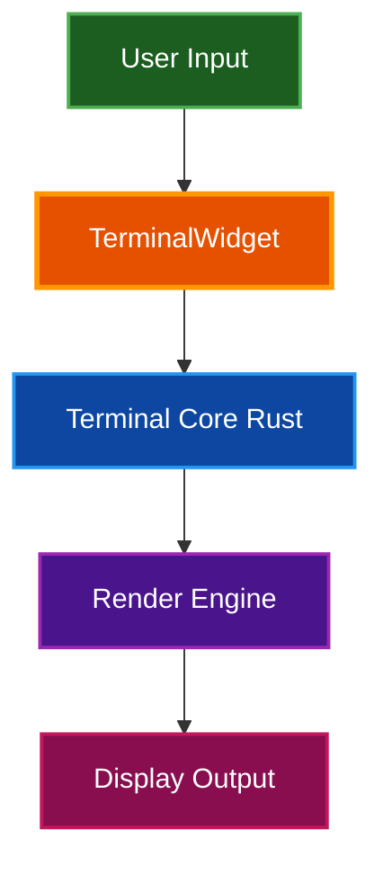
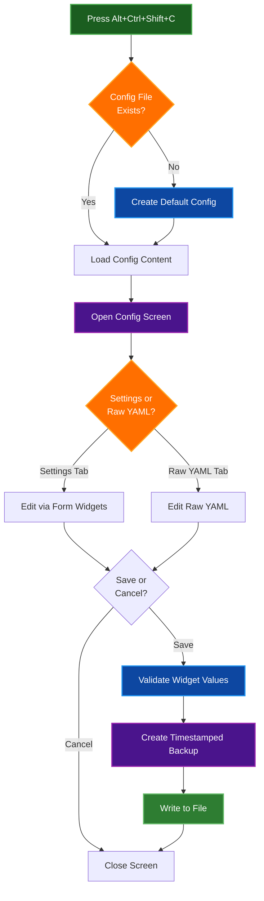
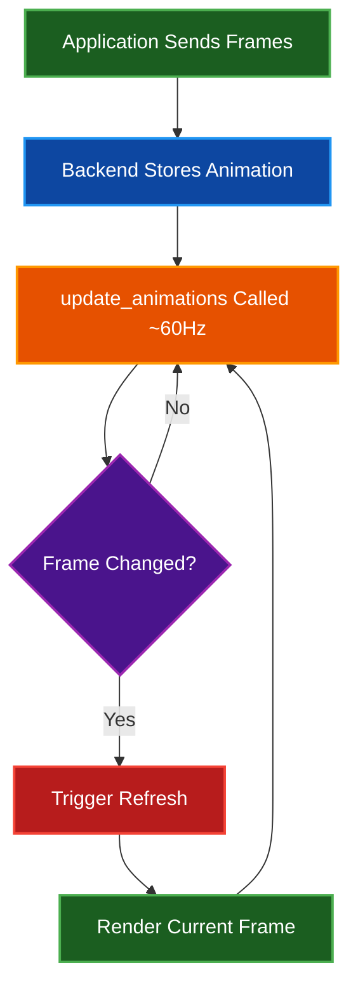
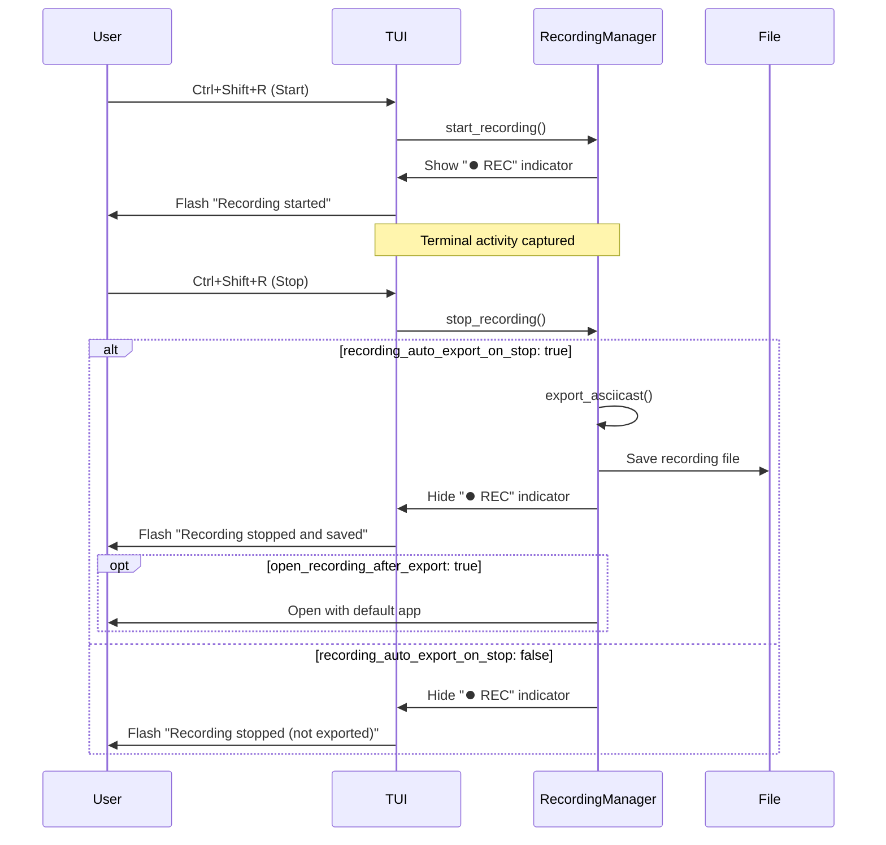

# Features

Comprehensive overview of Par Term Emu TUI Rust features and capabilities.

## Table of Contents
- [Overview](#overview)
- [Core Features](#core-features)
- [Configuration Editor](#configuration-editor)
- [Terminal Emulation](#terminal-emulation)
- [Graphics Protocol](#graphics-protocol)
- [Scrollback Buffer](#scrollback-buffer)
- [Mouse Support](#mouse-support)
- [Hyperlinks](#hyperlinks)
- [Notifications](#notifications)
- [Clipboard Integration](#clipboard-integration)
- [Session Recording](#session-recording)
- [Visual Bell](#visual-bell)
- [Cursor Customization](#cursor-customization)
- [Keyboard Protocol](#keyboard-protocol)
- [Shell Integration](#shell-integration)
- [Theme System](#theme-system)
- [Related Documentation](#related-documentation)

## Overview

Par Term Emu TUI Rust is a modern terminal emulator TUI built with Textual and par-term-emu-core-rust. It combines efficient rendering with comprehensive terminal emulation features.

### Technology Stack

| Component | Technology | Purpose |
|-----------|-----------|---------|
| **UI Framework** | Textual | Text-based user interface |
| **Terminal Core** | par-term-emu-core-rust | Terminal emulation engine (Rust) |
| **Language** | Python 3.12+ | Application logic and glue code |
| **Configuration** | PyYAML | YAML-based configuration |
| **Clipboard** | pyperclip | Cross-platform clipboard support |
| **Paths** | xdg-base-dirs | XDG Base Directory compliance |

> **📝 Note:** See `pyproject.toml` for current dependency versions.

## Core Features

### Custom Terminal Widget

A Textual widget that wraps `PtyTerminal` from `par-term-emu-core-rust`:

- **Efficient Rendering**: Uses Textual's Strip API for optimal performance
- **Partial Updates**: Only re-renders changed lines via generation tracking
- **Dynamic Sizing**: Adapts to terminal window resize with SIGWINCH
- **Color Accuracy**: Full 24-bit RGB color support
- **Text Attributes**: Bold, italic, underline, strikethrough, dim, reverse video



### Responsive Design

- **Automatic Resize**: Terminal dimensions update on window resize
- **Layout Management**: CSS-based component positioning
- **Auto-focus**: Terminal widget receives focus on startup
- **Status Bar**: Optional status bar with directory tracking

## Configuration Editor

### Interactive Config Editor

A built-in tabbed configuration screen for managing settings directly within the TUI:

**Key Features:**
- **Dual Edit Modes**:
  - **Settings Tab**: Widget-based form with checkboxes, inputs, and dropdowns
  - **Raw YAML Tab**: Full YAML editor with syntax highlighting (Monokai theme)
- **Live Validation**: Real-time YAML syntax checking before saving
- **Auto-Creation**: Automatically creates config file with defaults if it doesn't exist
- **Type-Safe Editing**: Form widgets enforce correct types (boolean, integer, float, color tuples)
- **Context Help**: Inline help text for every configuration option
- **Error Handling**: Clear error messages for invalid values or YAML syntax

**Access:**
- Press **Alt+Ctrl+Shift+C** while TUI is running
- Opens `~/.config/par-term-emu-tui-rust/config.yaml`

**Keyboard Shortcuts:**
- **Ctrl+S** - Save changes and close screen
- **Escape** - Cancel and discard changes
- **Tab** and **Shift+Tab** - Navigate between tabs and widgets
- Standard text editing (arrow keys, home/end, page up/down, etc.)

**Configuration Sections:**
- Selection & Clipboard
- Scrollback & Buffer
- Cursor
- Paste
- Mouse
- Theme & Colors
- Hyperlinks & URLs
- Screenshot
- Recording
- Notifications
- Clipboard Sync
- Shell & Security
- UI Elements
- Keyboard Protocol (KITTY)
- Search & Highlighting

**Use Cases:**
- Quick configuration adjustments without leaving TUI
- First-time setup with auto-generated defaults
- Testing configuration changes on the fly
- Safe editing with validation and type enforcement
- Explore available settings with contextual help

### Configuration Safety & Recovery (v0.4.0+)

**Automatic Backups:**
- Every config save creates timestamped backup: `config.yaml.backup.YYYYMMDD_HHMMSS`
- Stored alongside config file in `~/.config/par-term-emu-tui-rust/`
- UTC timestamps ensure consistency across timezones
- Enables easy rollback to previous working configurations

**Comprehensive Validation:**
- **Type Safety**: All values validated for correct types (int, float, bool, str, list, tuple)
- **Type Conversion**: Numeric values automatically converted from YAML strings
- **Range Validation**: Float values clamped to valid ranges (e.g., 0.0-1.0 for contrast settings)
- **Enum Validation**: Theme names and screenshot formats validated against allowed values
- **RGB Validation**: Color tuples checked for proper format and ranges
- **Auto-Correction**: Invalid values automatically corrected with user warnings

**Interactive Recovery:**
When config parsing fails (invalid YAML, corrupted file), interactive prompt offers:
1. Reset to defaults - Fresh start with factory settings
2. Restore from backup - Choose from timestamped backups
3. View all backups - List available backup files
4. Exit - Cancel and exit application

**User Notifications:**
- Warning toast after save: "Restart the TUI for changes to take effect"
- Clear feedback about validation corrections
- Parse failure messages with recovery options



**Implementation:**
- Screen: `src/par_term_emu_tui_rust/dialogs/config_screen.py`
- Action binding: `src/par_term_emu_tui_rust/app.py` (action_edit_config)
- Uses Textual's ModalScreen, TabbedContent, and form widgets
- Settings tab with Input, Checkbox, and Select widgets for type-safe editing
- Raw YAML tab with TextArea, syntax highlighting (Monokai), and line numbers
- Integrates with TuiConfig for default value generation and type validation
- Flash messages for user feedback on save/error
- Automatic config backup on save with UTC timestamp

## Terminal Emulation

### ANSI Support

**Color capabilities:**
- 16-color ANSI palette
- 256-color extended palette
- 24-bit true color (RGB)
- Custom color themes

**Text formatting:**
- **Bold** text rendering
- *Italic* text rendering
- Underline text rendering
- ~~Strikethrough~~ text rendering
- Dim text rendering
- Reverse video

### Control Sequences

**Supported sequences:**
- **CSI** - Control Sequence Introducer
- **OSC** - Operating System Commands
- **DCS** - Device Control String
- **DECSCUSR** - Cursor style control
- **SGR** - Select Graphic Rendition
- **CUP** - Cursor positioning
- **KITTY Keyboard Protocol** - Enhanced keyboard input handling

**Cursor control:**
- Position (absolute and relative)
- Save and restore position
- Style (block, underline, bar)
- Blink control
- Visibility toggle

**Keyboard protocol:**
- KITTY keyboard protocol support for enhanced input
- Disambiguate ambiguous keys (Ctrl+I vs Tab, etc.)
- Optional key release events
- Alternate key representations
- Auto-detection of application protocol requests
- See [Keyboard Protocol Guide](KEYBOARD_PROTOCOL.md) for details

## Graphics Protocol

Full support for inline graphics display using industry-standard graphics protocols. Graphics are rendered directly in the terminal using Unicode half-block characters for efficient display.

### Supported Graphics Protocols

**Sixel Graphics:**
- Original DEC VT340 graphics protocol
- Widely supported across terminal emulators
- Lossless bitmap image transmission
- Palette-based color encoding

**Kitty Graphics Protocol:**
- Modern graphics protocol with advanced features
- Direct PNG/RGB image transmission
- Animation support with frame control
- Placement control (columns, rows, offsets)
- Virtual image IDs for efficient management

**iTerm2 Inline Images Protocol:**
- Inline image display protocol
- Base64-encoded image transmission
- Multiple format support (PNG, JPEG, GIF, etc.)
- Preserves aspect ratio

### Graphics Rendering

**Rendering technique:**
- Uses Unicode half-block character (▀ U+2580)
- Achieves 2:1 vertical compression
- Foreground color = top pixel
- Background color = bottom pixel
- Efficient terminal-space utilization

**Display capabilities:**
- Full RGB color support
- Alpha channel transparency
- Scrollback integration - graphics scroll with text
- Multiple graphics per screen
- Overlapping graphics support

### Animation Support

**Kitty Animation Features:**
- Multi-frame animation transmission
- Frame delay control (milliseconds)
- Looping control:
  - Infinite looping
  - Finite loop count
  - Single play
- Animation state control:
  - Play/pause
  - Stop
  - Frame loading mode
- Automatic frame updates at ~60Hz

**Animation workflow:**



### Testing Graphics

**Display Sixel images:**
```bash
# Using included utility script
uv run python scripts/display_image_sixel.py path/to/image.png

# With scaling
uv run python scripts/display_image_sixel.py path/to/image.png --scale 0.5
```

**Test Kitty animations:**
```bash
# Run animation test script
uv run python scripts/test_kitty_animation.py
```

### Use Cases

**Sixel graphics:**
- Image viewers (viu, chafa, img2sixel)
- Terminal-based image browsers
- Data visualization tools
- ASCII art with color

**Kitty graphics:**
- Modern terminal applications
- Advanced image viewers
- Animation playback
- Rich media display

**iTerm2 inline images:**
- Shell integration image display
- Preview utilities
- Cross-platform compatibility

### Implementation Details

**Backend integration:**
- Graphics managed by Rust terminal core (`par-term-emu-core-rust`)
- Storage, parsing, and state management in Rust
- Python TUI handles rendering via half-block technique

**Scrollback behavior:**
- Graphics scroll with text content
- `scroll_offset_rows` tracks scrolled portions
- Efficient rendering only for visible portions
- Full graphics preserved in scrollback history

**Performance:**
- Animation updates at ~60Hz via `update_animations()`
- Only changed animations trigger refresh
- Cached style objects for rendering efficiency
- Half-block technique reduces terminal cell usage by 50%

### Related Scripts

Graphics testing utilities in `scripts/`:
- `display_image_sixel.py` - Sixel image display utility with auto-sizing
- `test_kitty_animation.py` - Kitty animation protocol demonstration

See `scripts/README.md` for complete documentation.

## Scrollback Buffer

Navigate through terminal history to view previous output.

### Scrollback Features

**Keyboard navigation:**
- `Shift+PageUp` - Scroll up one page
- `Shift+PageDown` - Scroll down one page
- `Shift+Home` - Jump to top of history
- `Shift+End` - Jump to bottom (live output)

**Mouse navigation:**
- Mouse wheel scrolling (when mouse tracking disabled)
- Smooth scrolling through history
- Position maintained during new output

**Automatic behavior:**
- At bottom: New content auto-scrolls into view
- Scrolled up: Position maintained as new output arrives
- Preserves all formatting (colors, attributes, wide characters)

### Configuration

```yaml
# Scrollback settings
scrollback_lines: 10000          # Maximum history lines (0 = unlimited)
max_scrollback_lines: 100000     # Safety limit for unlimited mode
mouse_wheel_scroll_lines: 3      # Lines per wheel tick
```

## Mouse Support

### Text Selection

**Selection modes:**

| Action | Selection Type | Description |
|--------|---------------|-------------|
| **Shift + Click & Drag** | Character | Select arbitrary text region character-by-character |
| **Double-Click** | Word | Select word at cursor |
| **Double-Click + Drag** | Word | Extend selection by words |
| **Triple-Click** | Line | Select entire line |
| **Triple-Click + Drag** | Line | Extend selection by lines (up or down) |

**Selection behavior:**
- **Auto-copy**: Selection automatically copied to clipboard on mouse up
- **Keep selection**: Highlighting persists after copy (configurable)
- **Word boundaries**: Configurable word characters for word selection
- **Wrapped lines**: Triple-click follows line wrapping (configurable)
- **Drag extension**: After double/triple-click, drag to extend selection by words/lines
- **Anchor point**: When dragging after multi-click, original click position remains anchored

### Mouse Actions

**Click actions:**
- **Left click**: Position cursor, start selection
- **Middle click**: Paste clipboard content
- **Right click**: Context menu (future enhancement)

**Mouse tracking:**
- Applications can enable mouse tracking (vim, tmux, etc.)
- Events forwarded to application when tracking enabled
- Falls back to selection mode when tracking disabled

### Configuration

```yaml
# Mouse settings
middle_click_paste: true                      # Paste on middle click
focus_follows_mouse: false                    # Auto-focus on hover
word_characters: "/-+\\~_."                   # Word boundary characters
triple_click_selects_wrapped_lines: true      # Follow wrapping
```

## Hyperlinks

Click URLs to open in your default browser.

### Hyperlink Types

**OSC 8 hyperlinks:**
```bash
# Embedded hyperlink with text
echo -e '\e]8;;https://example.com\e\\Click me!\e]8;;\e\\'
```

**Plain text URLs:**
- Automatically detected patterns
- Supported schemes: `http://`, `https://`, `ftp://`, `file://`, etc.
- Smart URL parsing

### Configuration

```yaml
# Hyperlink settings
clickable_urls: true                               # Enable URL clicking
link_color: [100, 150, 255]                       # RGB color for links
url_modifier: "ctrl"                               # Modifier key: none, ctrl, shift, alt
allowed_url_schemes: ["http", "https", "ftp", "ftps", "file", "mailto"]  # Allowed URL schemes
warn_on_unknown_url_scheme: true                   # Warn when blocking unsupported schemes
```

**Modifier options:**
- `none` - Click URLs directly
- `ctrl` - Require Ctrl+Click (default)
- `shift` - Require Shift+Click
- `alt` - Require Alt+Click

## Notifications

Terminal applications can display desktop-style notifications.

### Notification Types

**OSC 9 - Simple notifications:**
```bash
# Basic notification
echo -e '\x1b]9;Build completed!\x1b\\'
```

**OSC 777 - Titled notifications:**
```bash
# Notification with title
echo -e '\x1b]777;notify;Build Status;Compilation successful\x1b\\'
```

### Display Behavior

- Toast messages appear in top-right corner
- Auto-dismiss after timeout
- Non-intrusive overlay
- Stack multiple notifications

### Configuration

```yaml
# Notification settings
show_notifications: true                  # Enable/disable notifications
notification_timeout: 5                   # Display duration in seconds
notification_bell_desktop: false          # Forward BEL to desktop notifications
notification_bell_sound: 0                # Bell sound volume (0-100, 0 = disabled)
notification_bell_visual: true            # Backend visual flash overlay
notification_activity_enabled: false      # Alert when activity resumes after inactivity
notification_activity_threshold: 10       # Seconds of inactivity before activity alert
notification_silence_enabled: false       # Alert after prolonged silence
notification_silence_threshold: 300       # Seconds of silence before alert
notification_max_buffer: 64               # Maximum OSC 9/777 entries buffered
```

**Backend integration:**
- Desktop bell alerts: Forward BEL events to OS notification center
- Sound alerts: Adjustable volume (0-100) for backend audio on BEL events
- Visual bell: Backend flash overlay (independent of TUI bell icon)
- Activity detection: Triggers when terminal output resumes after configured inactivity period
- Silence detection: Alerts when terminal remains silent for configured duration
- Buffer management: Prevents unbounded memory growth from notification backlog

## Clipboard Integration

Cross-platform clipboard support for seamless copy/paste.

### Clipboard Features

**Copy methods:**
- Auto-copy on selection release
- Ctrl+Shift+C manual copy (also Cmd+C on macOS)
- Double-click word copy
- Triple-click line copy

**Paste methods:**
- Middle-click paste (Linux: PRIMARY selection)
- Ctrl+Shift+V keyboard paste
- Cmd+V on macOS, Ctrl+V on Windows and Linux
- Paste confirmation for large content
- Chunked pasting for large content (configurable chunk size and delay)

### OSC 52 Support

Applications can access clipboard:

```yaml
# Clipboard settings
expose_system_clipboard: true   # Allow OSC 52 clipboard read
```

> **🔒 Security:** Disable `expose_system_clipboard` to prevent applications from reading clipboard

### Configuration

```yaml
# Clipboard settings
auto_copy_selection: true                 # Auto-copy on selection
keep_selection_after_copy: true           # Keep highlighting after copy
expose_system_clipboard: true             # Allow OSC 52 access
copy_trailing_newline: false              # Include newline in line copy
paste_chunk_size: 0                       # Chunk size for large pastes (0 = disabled)
paste_chunk_delay_ms: 10                  # Delay between chunks
paste_warn_size: 100000                   # Warn before pasting large content
clipboard_max_sync_events: 64             # Max clipboard sync events for diagnostics
clipboard_max_event_bytes: 2048           # Max bytes per clipboard sync event
```

**Clipboard Sync Limits (v0.4.0+):**
- `clipboard_max_sync_events`: Caps the number of clipboard synchronization events stored in the backend for diagnostics (prevents unbounded memory use)
- `clipboard_max_event_bytes`: Limits the payload size retained per clipboard sync event (large payloads are truncated)

## Session Recording

Record terminal sessions with full fidelity for later playback using asciinema or custom players.

### Recording Features

**Capture capabilities:**
- All terminal I/O events (input, output, resize)
- Millisecond-precision timestamps
- Session metadata (terminal size, title, environment)
- Automatic file export on stop

**Supported formats:**
- **Asciicast v2**: Compatible with asciinema player
- **JSON**: Full session data for custom processing

### Recording Control

**Keyboard shortcut:**
- **Ctrl+Shift+R** - Toggle recording (start/stop)

**Visual indicator:**
- Recording icon (⏺️ REC) appears in header when active
- Flash message confirms start/stop actions
- Auto-export notification shows saved file path

### Recording Workflow



### Playback

**Using asciinema:**
```bash
# Play recording
asciinema play terminal_recording_20250119_120000.cast

# Upload to share
asciinema upload terminal_recording_20250119_120000.cast
```

**Using web player:**
```bash
# Open in browser (if configured)
# Opens automatically after export when open_recording_after_export: true
```

### Configuration

```yaml
# Recording settings
recording_directory: null                              # Save location (null = auto-detect)
recording_format: "asciicast"                         # Format: asciicast or json
recording_title_template: "Terminal Session {timestamp}"  # Title template
recording_auto_export_on_stop: true                   # Auto-export when stopped
open_recording_after_export: false                    # Auto-open after export
```

**Directory selection priority** (when `recording_directory` is `null`):
1. Shell's current working directory (from OSC 7 shell integration)
2. `XDG_VIDEOS_DIR/Recordings` (if XDG_VIDEOS_DIR is set) or `~/Videos/Recordings`
3. Home directory (final fallback)

### Use Cases

**Documentation:**
- Capture command sequences for tutorials
- Record troubleshooting sessions
- Create reproducible examples

**Training:**
- Record demonstrations for team training
- Build library of common procedures
- Share best practices

**Debugging:**
- Capture intermittent issues
- Share terminal state with support
- Review command history with timing

## Visual Bell

The terminal supports visual bell notifications using a flash overlay system when applications send a bell character (BEL/\x07).

### Bell Behavior

**Bell Trigger:**
- Terminal applications send BEL character (`\x07`)
- Examples: `echo -e "\a"`, `printf "\007"`, system alerts
- Common in shells for completion alerts, errors, or notifications

**Visual Indicators:**

1. **Flash Overlay (BellFlash)**:
   - Centered overlay with bell icon (🔔)
   - Appears briefly then auto-dismisses
   - Immediate, attention-grabbing visual feedback
   - Uses warning color theme with rounded border

**User Interaction:**
- Flash overlay dismisses automatically
- Non-disruptive visual notification
- No audio component (visual only)

### Configuration

```yaml
# Visual bell settings
visual_bell_enabled: true   # Enable visual bell indicator (default: true)
```

### Use Cases

**Development:**
- Build completion notifications
- Test failure alerts
- Long-running process completion

**System Administration:**
- Command execution alerts
- Log monitoring notifications
- Background task completion

**Shell Integration:**
- Prompt customization
- Error highlighting
- Interactive tool notifications

> **💡 Tip:** The visual bell provides non-disruptive notification without audio alerts, making it ideal for quiet work environments or when audio is disabled.

## Cursor Customization

### Cursor Styles

**Blinking cursors:**
- `blinking_block` - Solid blinking block
- `blinking_underline` - Blinking underline
- `blinking_bar` - Vertical blinking bar

**Steady cursors:**
- `steady_block` - Always-visible block
- `steady_underline` - Always-visible underline
- `steady_bar` - Always-visible vertical bar

### Configuration

```yaml
# Cursor settings
cursor_style: "blinking_block"    # Default cursor appearance
cursor_blink_enabled: false       # Enable cursor blinking
cursor_blink_rate: 0.5           # Blink interval in seconds
```

> **📝 Note:** Applications can change cursor style via DECSCUSR sequences. The TUI respects application-set styles.

## Keyboard Protocol

Enhanced keyboard input support using the KITTY keyboard protocol.

### KITTY Protocol Features

The KITTY keyboard protocol provides:

- **Key Disambiguation**: Distinguish Ctrl+I from Tab, Ctrl+M from Enter, etc.
- **Key Release Events**: Applications can receive key release notifications
- **Alternate Representations**: Multiple ways to represent the same key
- **Report All Keys**: Send escape codes for all keys
- **Associated Text**: Include text representation with events

### Configuration

```yaml
# KITTY keyboard protocol settings
keyboard_protocol_enabled: false        # Enable protocol globally
keyboard_protocol_flags: 1              # Feature flags (1=disambiguate, 2=events, 4=alternate, 8=report_all, 16=text)
keyboard_protocol_auto_detect: false    # Auto-enable when apps request it
```

### Usage Modes

**Manual Mode** (`keyboard_protocol_enabled: true`):
- Always sends KITTY protocol sequences
- Configured flags are used for all applications
- Best for terminal-only environments

**Auto-Detection Mode** (`keyboard_protocol_auto_detect: true`):
- Monitors terminal output for protocol activation (CSI >flags u)
- Automatically enables when applications request it
- Automatically disables when applications stop using it
- Seamless integration with supporting applications

**Disabled** (default):
- Uses traditional escape sequences
- Compatible with all applications
- No protocol overhead

### Supported Applications

Applications with KITTY protocol support:
- Neovim (with terminal emulator plugins)
- Kakoune text editor
- Any application using the KITTY protocol library

See [Keyboard Protocol Guide](KEYBOARD_PROTOCOL.md) for detailed documentation.

## Shell Integration

Enhanced features through shell integration scripts.

### Features Provided

**Current working directory:**
- Tracked via OSC 7 sequences (requires shell integration)
- Displayed in status bar with shell statistics: total commands, failed commands, average duration
- Used for screenshot and recording directory selection
- Compact display format: "📁 ~/path/to/dir | ⚙ cmds 42 | 2 fail | avg 15ms"

**Prompt navigation:**
- Mark prompt locations
- Jump between prompts
- Navigate command history

**Command status:**
- Track command success/failure
- Display exit codes
- Highlight errors

### Installation

Shell integration is installed using the built-in installer:

```bash
# Install for current shell
par-term-emu-tui-rust install shell-integration

# Install for specific shell
par-term-emu-tui-rust install shell-integration bash
par-term-emu-tui-rust install shell-integration zsh
par-term-emu-tui-rust install shell-integration fish

# Install for all shells
par-term-emu-tui-rust install shell-integration --all
```

**Supported shells:**
- Bash
- Zsh
- Fish

## Theme System

### Built-in Themes

| Theme | Description | Best For |
|-------|-------------|----------|
| `dark-background` | Classic dark terminal | General use (default) |
| `high-contrast` | High contrast colors | Accessibility |
| `iterm2-dark` | iTerm2 Dark theme | macOS terminal users |
| `light-background` | Classic light terminal | Bright environments |
| `pastel-dark` | Soft pastel on dark | Reduced eye strain |
| `regular` | Regular theme | Balanced colors |
| `smoooooth` | Smooth dark theme | Easy on eyes |
| `solarized` | Solarized theme | Consistent scheme |
| `solarized-dark` | Solarized Dark | Precise color matching |
| `solarized-light` | Solarized Light | Bright, balanced |
| `tango-dark` | Tango Dark | GNOME-style dark |
| `tango-light` | Tango Light | GNOME-style light |

### Theme Components

Each theme defines:
- 16 ANSI palette colors
- Background and foreground colors
- Cursor and cursor text colors
- Selection background and text colors
- Hyperlink color
- Bold text color
- Cursor guide color
- Underline color
- Badge color
- Match/search highlight color

### Theme Management

**List themes:**
```bash
par-term-emu-tui-rust --list-themes
```

**Apply theme:**
```bash
# Temporary (session only)
par-term-emu-tui-rust --theme solarized-dark

# Permanent (save to config)
par-term-emu-tui-rust --apply-theme solarized-dark
```

**Custom themes:**
```bash
# Export current theme
par-term-emu-tui-rust --export-theme my-theme

# Edit my-theme.yaml to customize

# Apply custom theme
par-term-emu-tui-rust --apply-theme-from my-theme.yaml
```

## Related Documentation

- [Quick Start Guide](QUICK_START.md) - Get started quickly
- [Installation Guide](INSTALLATION.md) - Install and setup
- [Usage Guide](USAGE.md) - Command-line options and usage
- [Key Bindings](KEY_BINDINGS.md) - Keyboard and mouse reference
- [Keyboard Protocol](KEYBOARD_PROTOCOL.md) - KITTY keyboard protocol support
- [Configuration Reference](CONFIG_REFERENCE.md) - All configuration settings
- [Screenshots Guide](SCREENSHOTS.md) - Screenshot functionality
- [Themes Guide](THEMES.md) - Theme customization and management
- [Architecture](ARCHITECTURE.md) - System design and implementation details
- [Troubleshooting](TROUBLESHOOTING.md) - Common issues and solutions
