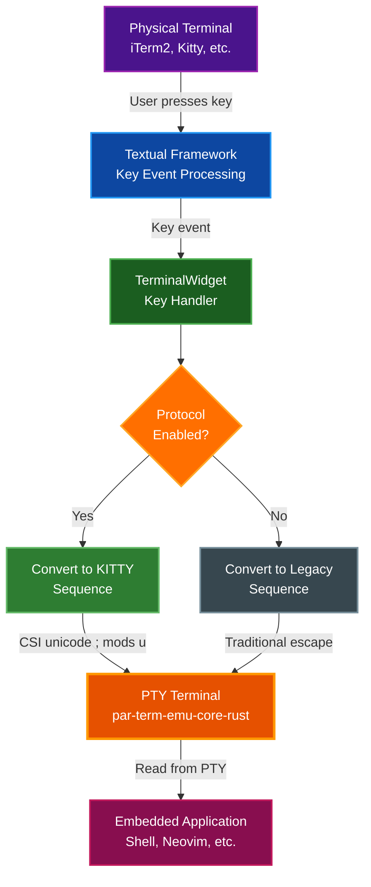

# KITTY Keyboard Protocol Support

## Overview

The terminal emulator supports the KITTY keyboard protocol for enhanced keyboard input handling. This allows embedded applications to:

- **Distinguish ambiguous keys**: Ctrl+I vs Tab, Ctrl+M vs Enter, Ctrl+H vs Backspace, etc.
- **Receive key release events**: With flag 2, apps can detect when keys are released (useful for games and advanced editors)
- **Get alternate key representations**: With flag 4, apps can receive alternate interpretations of keys

## Enabling the Protocol

There are two modes for enabling KITTY keyboard protocol:

### Mode 1: Manual Enable (Option A)

Manually enable protocol for all embedded applications.

**Via Configuration File:**

Edit `~/.config/par-term-emu-tui-rust/config.yaml`:

```yaml
# Keyboard Protocol (KITTY)
keyboard_protocol_enabled: true   # Enable for embedded apps
keyboard_protocol_flags: 1         # Flag 1 = disambiguate (recommended)
```

**Via Command Line:**

```bash
# Enable with default flags (1 = disambiguate)
par-term-emu-tui-rust --keyboard-protocol

# Disable (override config file)
par-term-emu-tui-rust --no-keyboard-protocol

# Enable with specific flags
par-term-emu-tui-rust --keyboard-protocol --keyboard-protocol-flags 3

# Flags 3 = 1 + 2 (disambiguate + key release events)
par-term-emu-tui-rust --keyboard-protocol --keyboard-protocol-flags 3
```

### Mode 2: Auto-Detect (Option B) - RECOMMENDED

Automatically enable protocol when applications request it. This is the smart, seamless option.

**Via Configuration File:**

Edit `~/.config/par-term-emu-tui-rust/config.yaml`:

```yaml
# Keyboard Protocol (KITTY) - Auto-detect mode
keyboard_protocol_auto_detect: true   # Auto-enable when apps request it
# Note: keyboard_protocol_flags is ignored in auto-detect mode.
# The TUI uses whatever flags the application requests.
```

**Via Command Line:**

```bash
# Enable auto-detection
par-term-emu-tui-rust --keyboard-protocol-auto-detect

# Disable auto-detection (override config)
par-term-emu-tui-rust --no-keyboard-protocol-auto-detect
```

**How Auto-Detect Works:**

1. **App requests protocol**: When an application (like Neovim) sends `CSI >flags u`, the TUI automatically detects this and starts forwarding enhanced keyboard sequences
2. **App disables protocol**: When the app sends `CSI <u` or exits, the TUI automatically reverts to legacy sequences
3. **Zero configuration**: Works seamlessly with supporting apps - no manual setup needed
4. **Backward compatible**: Legacy apps that don't use KITTY protocol continue to work normally

**Which Mode Should I Use?**

| Mode | Use When | Pros | Cons |
|------|----------|------|------|
| **Manual** (Option A) | You always want enhanced keys, regardless of app support | Simple, predictable | Apps must support protocol |
| **Auto-Detect** (Option B) | You want it to "just work" | Automatic, seamless, no config needed | Slightly more complex |

**Recommendation**: Use **Auto-Detect** (Option B) for the best user experience. It automatically adapts to whatever app you're running.

## Protocol Flags

Protocol features are controlled by combining flag values:

| Flag Value | Feature | Description | Support Status |
|------------|---------|-------------|----------------|
| 1 | Disambiguate | Distinguish Ctrl+I from Tab, Ctrl+M from Enter, etc. | ✅ **Fully Supported** |
| 2 | Report Events | Report both key press AND release events | ❌ Not supported (Textual limitation) |
| 4 | Alternate Keys | Report alternate key representations | ❌ Not supported (Textual limitation) |
| 8 | Report All | Report all keys as escape codes | ✅ Supported via flag 1 |
| 16 | Associated Text | Include associated text with events | ❌ Not supported (Textual limitation) |

### Combining Flags

Add flag values together to enable multiple features. Note that due to Textual framework limitations, only flag 1 (disambiguation) is currently effective:

```yaml
# Just disambiguation (recommended and fully supported)
keyboard_protocol_flags: 1

# Disambiguation + key release events (flag 2 has no effect due to Textual limitation)
keyboard_protocol_flags: 3   # 1 + 2

# Disambiguation + events + alternate keys (flags 2 and 4 have no effect)
keyboard_protocol_flags: 7   # 1 + 2 + 4
```

**Note**: While you can configure flags 2, 4, 8, and 16, they will not have any effect due to Textual framework constraints. Only flag 1 (disambiguation) is currently functional.

## How It Works

### Traditional Terminal Problem

In traditional terminals, these keys send identical sequences:

- **Ctrl+I** and **Tab** both send `\t` (0x09)
- **Ctrl+M** and **Enter** both send `\r` (0x0D)
- **Ctrl+H** and **Backspace** both send `\x08` or `\x7F`
- **Ctrl+[** and **Escape** both send `\x1B`

This prevents applications from binding these keys separately.

### KITTY Protocol Solution

With KITTY protocol enabled, each key gets a unique sequence:

| Key | Legacy Sequence | KITTY Sequence | Disambiguated? |
|-----|----------------|----------------|----------------|
| Ctrl+I | `\x09` | `\x1b[105;5u` | ✅ Yes |
| Tab | `\x09` | `\x1b[9u` | ✅ Yes |
| Ctrl+M | `\r` | `\x1b[109;5u` | ✅ Yes |
| Enter | `\r` | `\x1b[13u` | ✅ Yes |
| Ctrl+H | `\x08` | `\x1b[104;5u` | ✅ Yes |
| Backspace | `\x7F` | `\x1b[127u` | ✅ Yes |
| Ctrl+[ | `\x1b` | `\x1b[91;5u` | ✅ Yes |
| Escape | `\x1b` | `\x1b[27u` | ✅ Yes |

## Compatible Applications

### Applications That Support KITTY Protocol

These applications can take advantage of enhanced keyboard input:

- **Neovim** (requires `vim.o.kitty_keyboard_protocol = true` in config)
- **Kakoune** editor
- **Helix** editor
- Custom TUI applications that query and use KITTY protocol
- `cat -v` (useful for testing)

### Legacy Applications

These applications will continue to work normally (protocol sends legacy sequences as fallback):

- **Vim** (original)
- **Emacs**
- **Bash**, **Zsh**, **Fish** shells
- **htop**, **btop**
- Any application that doesn't use KITTY protocol

## Testing

### Basic Test with `cat -v`

The simplest way to test if the protocol is working:

```bash
# Start terminal with protocol enabled
par-term-emu-tui-rust --keyboard-protocol

# Inside the terminal, run:
cat -v

# Press Ctrl+I
# Expected output: ^[[105;5u

# Press Tab
# Expected output: ^[[9u

# They should be DIFFERENT!
# Press Ctrl+C to exit cat
```

### Test with Legacy Mode

```bash
# Start terminal WITHOUT protocol (default)
par-term-emu-tui-rust

# Inside terminal:
cat -v

# Press Ctrl+I
# Expected output: ^I

# Press Tab
# Expected output: ^I (same as Ctrl+I)

# Press Ctrl+C to exit
```

### Test Auto-Detection (Option B)

```bash
# Start terminal with auto-detect enabled
par-term-emu-tui-rust --keyboard-protocol-auto-detect --debug

# Inside terminal, manually request protocol (simulate what nvim does)
printf '\x1b[>1u'  # Request protocol with flag 1

# Now test with cat
cat -v

# Press Ctrl+I
# Expected: ^[[105;5u  (KITTY sequence - auto-detected!)

# Press Tab
# Expected: ^[[9u  (different from Ctrl+I!)

# Exit cat, then manually disable protocol
printf '\x1b[<1u'  # Disable protocol

# Test again
cat -v

# Press Ctrl+I
# Expected: ^I  (back to legacy - auto-detected disable!)

# Protocol automatically adapts to app requests
```

### Query Protocol Support

Applications can query if the terminal supports KITTY protocol:

```bash
# Send query
printf '\x1b[?u'

# With protocol enabled, terminal responds:
# ^[[?1u  (flags = 1)

# Without protocol enabled:
# (no response or different response)
```

## Neovim Configuration

To enable KITTY protocol support in Neovim:

**Lua config** (`~/.config/nvim/init.lua`):

```lua
-- Enable KITTY keyboard protocol
vim.o.kitty_keyboard_protocol = true

-- Now you can bind Ctrl+I separately from Tab
vim.keymap.set('n', '<Tab>', ':tabnext<CR>', { desc = 'Next tab' })
vim.keymap.set('n', '<C-i>', '<C-i>', { desc = 'Jump forward (original)' })
```

**VimScript config** (`~/.vimrc`):

```vim
" Neovim only - enable KITTY keyboard protocol
set kitty-keyboard-protocol

" Bind keys separately
nnoremap <Tab> :tabnext<CR>
nnoremap <C-i> <C-i>
```

## Troubleshooting

### Keyboard Shows Codes Like "8u 5u" After Exiting TUI Apps

**Problem**: After exiting a TUI application (nvim, htop, etc.), keyboard input shows as escape codes instead of characters.

**This is automatically fixed** (as of v0.4.0):
- The terminal emulator **automatically resets** keyboard protocol state when:
  - Exiting alternate screen mode (when TUI apps exit)
  - Performing a full terminal reset
- No manual intervention needed

**Background**: Some TUI applications enable KITTY keyboard protocol but fail to disable it on exit (crash, improper cleanup, etc.). The terminal core now automatically cleans up this state to prevent corruption.

**If you still see this issue**:
1. Check you're running the latest version
2. Verify the TUI app is using alternate screen mode (most do)
3. Report as a bug - it should auto-reset

### Keys Not Working After Enabling Protocol

**Problem**: Some keys stop working when protocol is enabled.

**Solution**:
1. Check if your application supports KITTY protocol
2. Try with just flag 1 (disambiguation): `keyboard_protocol_flags: 1`
3. Disable protocol for legacy apps: `--no-keyboard-protocol`

**Check application support**:
```bash
# Most apps will ignore enhanced sequences and work normally
# But some might have issues - disable protocol for those apps
```

### Apps Not Receiving Enhanced Events

**Problem**: Apps don't seem to recognize the enhanced key sequences.

**Diagnosis**:
1. Verify protocol is enabled:
   ```bash
   # Check if this shows new sequences
   cat -v
   ```

2. Check app documentation for KITTY protocol support

3. Some apps need explicit configuration (see Neovim example above)

### Verifying Configuration

**Check current config**:
```bash
# View config file
cat ~/.config/par-term-emu-tui-rust/config.yaml | grep keyboard

# Should show:
# keyboard_protocol_enabled: true
# keyboard_protocol_flags: 1
```

**Check CLI override**:
```bash
# Explicitly enable
par-term-emu-tui-rust --keyboard-protocol

# Explicitly disable (overrides config)
par-term-emu-tui-rust --no-keyboard-protocol
```

## Use Cases

### Enhanced Text Editors

**Problem**: Can't bind Ctrl+I separately from Tab in Vim/Neovim.

**Solution**: Enable KITTY protocol, configure Neovim to use it.

```lua
-- ~/.config/nvim/init.lua
vim.o.kitty_keyboard_protocol = true

-- Now works!
vim.keymap.set('n', '<C-i>', ':MyCustomAction<CR>')
vim.keymap.set('n', '<Tab>', ':AnotherAction<CR>')
```

### Terminal Games

**Problem**: Games need to detect when keys are released (for movement, etc.).

**Current Limitation**: Key release events (flag 2) are not supported due to Textual framework constraints. The terminal emulator cannot report key releases because Textual's Key events only capture key presses.

**Workaround**: Applications must use alternative input methods:
- Polling-based movement (query key state repeatedly)
- Toggle-based controls (press once to start, press again to stop)
- Mouse-based input for games requiring precise control

### Advanced Key Bindings

**Problem**: Want to use more modifier combinations than traditional terminals support.

**Solution**: KITTY protocol supports all modifiers (Shift, Ctrl, Alt, Super, Hyper, Meta).

```bash
# All these are distinct with KITTY protocol:
# Ctrl+A
# Ctrl+Shift+A
# Ctrl+Alt+A
# Ctrl+Alt+Shift+A
# Super+A
# etc.
```

## Technical Details

### Architecture Overview

The following diagram illustrates how keyboard events flow from your physical terminal through the system to the embedded application:



**Key Points**:
- Your physical terminal (iTerm2, Kitty, etc.) sends keyboard events to Textual
- Textual processes these into Key events with information about the key and modifiers
- TerminalWidget receives Key events and decides whether to use KITTY or legacy encoding
- KITTY sequences provide disambiguation (Ctrl+I ≠ Tab), legacy sequences do not
- The PTY forwards sequences to the embedded application (shell, Neovim, etc.)

### Sequence Format

KITTY protocol sequences follow this format:

```
CSI unicode ; modifiers u
```

Where:
- **CSI** = `\x1b[` (Control Sequence Introducer)
- **unicode** = Unicode codepoint of the key (e.g., 97 for 'a')
- **modifiers** = Modifier bitmask + 1 (optional)
  - Shift = 1
  - Alt = 2
  - Ctrl = 4
  - Super = 8
  - Hyper = 16
  - Meta = 32
- **u** = Final character

### Examples

| Input | Unicode | Modifiers | Sequence |
|-------|---------|-----------|----------|
| `a` | 97 | 0 | `\x1b[97u` |
| Ctrl+A | 97 | 4+1=5 | `\x1b[97;5u` |
| Ctrl+Shift+A | 97 | (4\|1)+1=6 | `\x1b[97;6u` |
| Tab | 9 | 0 | `\x1b[9u` |
| Ctrl+I | 105 | 4+1=5 | `\x1b[105;5u` |
| F1 | 57376 | 0 | `\x1b[57376u` |

### Protocol Activation

Applications request KITTY protocol by sending sequences to the terminal:

```
CSI > flags u     (push flags to protocol stack)
CSI < flags u     (pop from protocol stack)
```

Example:
- `\x1b[>1u` - Application requests protocol with flag 1 (disambiguation)
- `\x1b[<1u` - Application disables protocol (pops from stack)

The terminal detects these sequences and responds by sending enhanced keyboard events back to the application. When auto-detect mode is enabled, the TUI automatically switches between KITTY and legacy key sequences based on these requests.

### Automatic State Reset

**Important**: The terminal core automatically resets keyboard protocol state to prevent corruption:

**When Reset Occurs**:
1. **Exiting alternate screen** - When any application exits alternate screen mode (returns to primary screen)
2. **Full terminal reset** - When processing RIS (Reset to Initial State) sequence

**What Gets Reset**:
- `keyboard_flags` → 0 (disabled)
- `keyboard_stack` → cleared
- `keyboard_stack_alt` → cleared

**Why This Matters**:
Some TUI applications (nvim, htop, btop, etc.) enable KITTY keyboard protocol but may exit without properly disabling it due to:
- Application crash
- Improper signal handling
- Missing cleanup code

Without automatic reset, the terminal would stay in protocol mode, causing keyboard input to appear as escape codes like "8u 5u" instead of characters.

**Implementation** (par-term-emu-core-rust):
- Reset happens in `Terminal::use_primary_screen()` method
- Triggered automatically when CSI ?1049l (exit alternate screen) is received
- No TUI-level intervention needed - handled entirely in the terminal core

### Backward Compatibility

- **Default**: Protocol is **disabled** - all apps work as before
- **When enabled**: Terminal sends KITTY sequences
- **Legacy apps**: Ignore enhanced sequences, receive traditional fallback
- **Supporting apps**: Parse KITTY sequences and benefit from enhanced input

## Limitations

### Current Implementation

The TUI implements KITTY keyboard protocol with the following support:

✅ **Fully Supported**:
- **Flag 1 (Disambiguation)**: Ctrl+I ≠ Tab, Ctrl+M ≠ Enter, etc.
- **All modifier combinations**: Shift, Alt, Ctrl, Super, Hyper, Meta
- **Function keys**: F1-F12 with modifiers
- **Arrow keys**: Up, Down, Left, Right with modifiers
- **Special keys**: Home, End, PageUp, PageDown, Insert, Delete
- **Manual mode**: Explicit enable/disable via config or CLI
- **Auto-detect mode**: Automatic protocol activation when apps request it

⚠️ **Limitations** (Textual framework constraints):
- **Flag 2 (Key release events)**: Not supported - Textual doesn't report key releases
- **Flag 4 (Alternate keys)**: Not supported - Textual doesn't provide alternate representations
- **Flag 8 (Report all keys)**: Supported through flag 1 implementation
- **Flag 16 (Associated text)**: Not supported - Textual doesn't include associated text

### Why These Limitations?

The terminal emulator receives keyboard input from **Textual framework**, which:
1. Receives KITTY protocol from your physical terminal (iTerm2, Kitty, etc.)
2. Processes keyboard events internally
3. Provides Key events to the TUI application
4. Does not expose key release or alternate key information

**Workaround**: These limitations are inherent to Textual's event model. To support flags 2, 4, and 16 would require:
- Upstream enhancements to Textual framework
- Modified Key event structure to include release state and alternates
- Changes to Textual's event processing pipeline

**Current recommendation**: Use flag 1 (default) for maximum compatibility and immediate value. This provides the most significant benefit (disambiguation) without compatibility issues.

## FAQ

**Q: Should I use Manual or Auto-Detect mode?**
A: **Auto-Detect (Option B) is recommended** for most users. It automatically adapts to whatever app you're running without any configuration.

**Q: Will this break my shell/apps?**
A: No. Legacy apps ignore the enhanced sequences and work normally. The protocol is designed for backward compatibility. With auto-detect, legacy apps never even see the enhanced sequences.

**Q: What's the recommended flag value?**
A: Start with `1` (disambiguation only). This provides the most value with minimal risk.

**Q: Can I use flag 2 for key release events?**
A: No - Textual framework doesn't report key releases to applications. This is a fundamental limitation of Textual's event model and would require upstream framework changes to support.

**Q: How do I know if my app supports KITTY protocol?**
A: Check the app's documentation, or test with `cat -v` to see if it generates enhanced sequences. With auto-detect enabled, you can also check the debug logs to see when apps request the protocol.

**Q: Does auto-detect have any performance impact?**
A: No. The detection logic runs only during PTY updates (when content changes) and is a simple integer comparison. The overhead is negligible.

**Q: Can I use both manual and auto-detect modes together?**
A: Yes! If both are enabled, the protocol will be active when EITHER condition is true. However, it's usually best to pick one mode or the other.

**Q: What happens if an app requests different flags than my config?**
A: With auto-detect, the app's requested flags take precedence. The terminal uses whatever flags the app sent via `CSI >flags u`.

**Q: Why isn't auto-detect enabled by default?**
A: To maintain backward compatibility and predictable behavior. Users opt-in to new features. However, it's safe to enable and recommended for daily use.

## See Also

- [KITTY Keyboard Protocol Specification](https://sw.kovidgoyal.net/kitty/keyboard-protocol/)
- [Textual Framework Documentation](https://textual.textualize.io/)
- [par-term-emu-core-rust](https://github.com/paulrobello/par-term-emu-core-rust)
- [VT100 Escape Sequences](https://vt100.net/docs/vt100-ug/chapter3.html)
- [Xterm Control Sequences](https://invisible-island.net/xterm/ctlseqs/ctlseqs.html)

## Related Documentation

- [Configuration Reference](CONFIG_REFERENCE.md) - All keyboard protocol configuration options
- [Key Bindings](KEY_BINDINGS.md) - Terminal keyboard shortcuts
- [Features](FEATURES.md) - Overview of all terminal features
