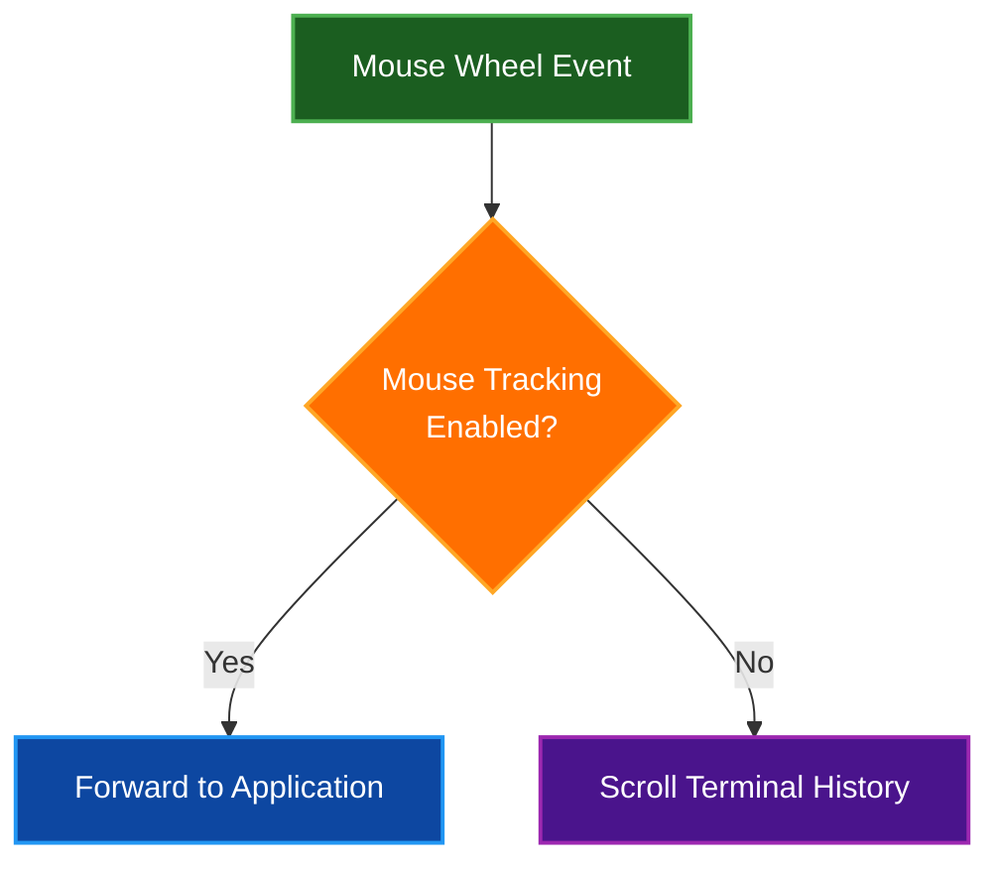
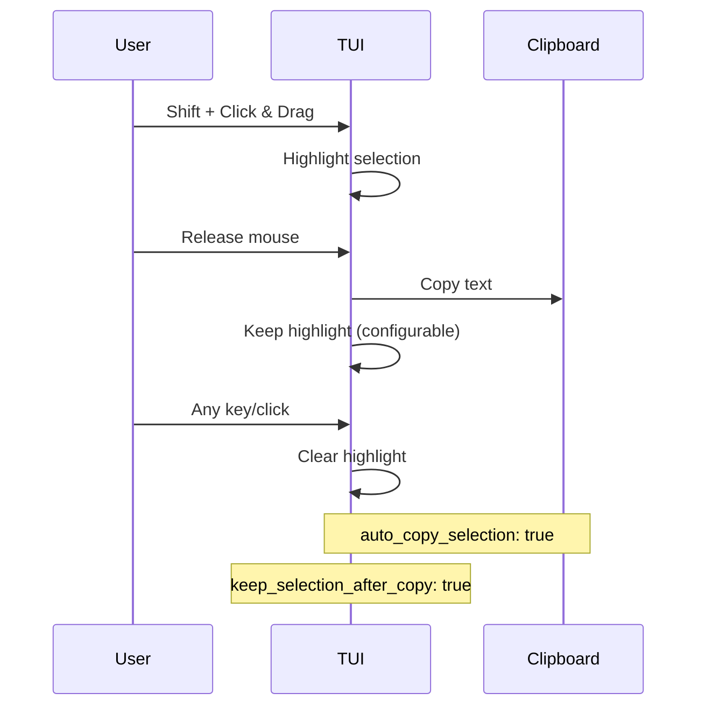

# Key Bindings Reference

Complete reference for keyboard shortcuts and mouse interactions in Par Term Emu TUI Rust.

## Table of Contents
- [Keyboard Shortcuts](#keyboard-shortcuts)
  - [Application-Level Shortcuts](#application-level-shortcuts)
  - [Terminal Widget Shortcuts](#terminal-widget-shortcuts)
  - [Navigation Shortcuts](#navigation-shortcuts)
- [Mouse Actions](#mouse-actions)
- [Text Selection](#text-selection)
- [Scrollback Navigation](#scrollback-navigation)
- [Clipboard Operations](#clipboard-operations)
- [Special Keys](#special-keys)
- [KITTY Keyboard Protocol](#kitty-keyboard-protocol)
  - [Resetting the Keyboard Protocol](#resetting-the-keyboard-protocol)
- [Application-Specific Bindings](#application-specific-bindings)
- [Customization](#customization)
- [Related Documentation](#related-documentation)

## Keyboard Shortcuts

### Application-Level Shortcuts

| Shortcut | Action | Description |
|----------|--------|-------------|
| **Ctrl+Shift+Q** | Quit application | Exit the TUI immediately |
| **Alt+Ctrl+Shift+C** | Edit config | Open config editor dialog |
| **Escape** (in config) | Cancel | Close config editor without saving |
| **Ctrl+S** (in config) | Save config | Save changes in config editor |

### Terminal Widget Shortcuts

| Shortcut | Action | Description |
|----------|--------|-------------|
| **Ctrl+Shift+S** | Take screenshot | Capture current terminal view |
| **Ctrl+Shift+R** | Toggle recording | Start/stop terminal session recording |
| **Ctrl+Shift+K** | Reset keyboard | Reset KITTY keyboard protocol to normal mode (see [KITTY Keyboard Protocol](#kitty-keyboard-protocol)) |
| **Ctrl+Shift+C** | Copy selection | Copy selected text to clipboard |
| **Ctrl+C** | Smart copy | Copy if text is selected, otherwise send SIGINT to terminal |
| **Cmd+C** (macOS) | Copy selection | Copy selected text to clipboard (macOS only) |
| **Ctrl+Shift+V** | Paste | Paste clipboard content to terminal |
| **Ctrl+V** | Paste | Paste clipboard content to terminal |
| **Cmd+V** (macOS) | Paste | Paste clipboard content to terminal (macOS only) |

### Navigation Shortcuts

| Shortcut | Action | Description |
|----------|--------|-------------|
| **Ctrl+Shift+PageUp** | Scroll up | Scroll up one page in history |
| **Ctrl+Shift+PageDown** | Scroll down | Scroll down one page in history |
| **Shift+Home** | Jump to top | Jump to top of scrollback |
| **Shift+End** | Jump to bottom | Jump to bottom (live output) |

## Mouse Actions

### Basic Mouse Operations

| Action | Result | Description |
|--------|--------|-------------|
| **Left Click** | Position cursor | Move cursor to click position |
| **Middle Click** | Paste | Paste clipboard (PRIMARY on Linux) |
| **Mouse Wheel Up** | Scroll up | Scroll up in history (when tracking off) |
| **Mouse Wheel Down** | Scroll down | Scroll down in history (when tracking off) |

### Mouse Wheel Behavior



**Configuration:**
```yaml
mouse_wheel_scroll_lines: 3  # Lines per wheel tick (default)
```

### Click Actions on Special Elements

| Element | Action | Result |
|---------|--------|--------|
| **URL (OSC 8)** | Click | Open URL in browser |
| **Plain URL** | Click | Open URL in browser |
| **URL (with modifier)** | Modifier+Click | Open URL (if configured) |

## Text Selection

### Selection Methods

| Method | Keys | Selection Type |
|--------|------|----------------|
| **Character** | Shift + Click & Drag | Character-by-character selection |
| **Word** | Double-Click | Word at cursor |
| **Word Extend** | Double-Click + Drag | Extend selection by words |
| **Line** | Triple-Click | Entire line |
| **Line Extend** | Triple-Click + Drag | Extend selection by lines (up/down) |
| **Extend** | Shift + Click | Extend current selection |

### Selection Behavior Flow



### Word Selection

**Double-click selects word based on word boundaries:**

**Default word characters:** `/-+\~_.`

**Example selections:**

| Text | Selected |
|------|----------|
| `hello-world` | `hello-world` (entire word) |
| `user@example.com` | `user` or `example` or `com` |
| `/path/to/file` | `/path/to/file` (entire path) |
| `~/.config` | `~/.config` (entire path) |

**Configuration:**
```yaml
word_characters: "/-+\\~_."  # Default (paths)
# For URLs: "-_.~:/?#[]@!$&'()*+,;="
```

### Line Selection

**Triple-click behavior:**

- **Wrapped lines enabled**: Selects complete logical line (follows wrapping)
- **Wrapped lines disabled**: Selects only visible screen line

**Triple-click + drag:**
- Drag up or down after triple-click to extend selection by full lines
- Original click position serves as anchor point
- Respects wrapped line settings during extension
- Auto-copy on mouse release (when `auto_copy_selection` enabled)

**Configuration:**
```yaml
triple_click_selects_wrapped_lines: true  # Follow wrapped lines
auto_copy_selection: true                  # Auto-copy on release
```

### Selection Copy Behavior

**Auto-copy settings:**
```yaml
auto_copy_selection: true           # Copy on selection release
keep_selection_after_copy: true     # Keep highlighting after copy
copy_trailing_newline: false        # Include \n in line copy
```

## Scrollback Navigation

### Keyboard Navigation

| Shortcut | Distance | Description |
|----------|----------|-------------|
| **Ctrl+Shift+PageUp** | 1 page | Scroll up by terminal height |
| **Ctrl+Shift+PageDown** | 1 page | Scroll down by terminal height |
| **Shift+Home** | To top | Jump to oldest scrollback line |
| **Shift+End** | To bottom | Jump to live output |

### Mouse Navigation

| Action | Distance | Description |
|--------|----------|-------------|
| **Wheel Up** | 3 lines (default) | Scroll up (configurable) |
| **Wheel Down** | 3 lines (default) | Scroll down (configurable) |

### Scrollback Indicators

**Visual feedback:**
- Position indicator in status bar
- Scroll position relative to total history
- Live output indicator when at bottom

### Scrollback Limits

```yaml
scrollback_lines: 10000         # Maximum history lines
max_scrollback_lines: 100000    # Safety limit for unlimited
```

## Clipboard Operations

### Copy Methods

| Method | Shortcut | Description |
|--------|----------|-------------|
| **Auto-copy** | Selection release | Automatic on selection end |
| **Manual copy** | Ctrl+Shift+C | Copy current selection |
| **Smart copy** | Ctrl+C | Copy if text selected, else SIGINT |
| **macOS copy** | Cmd+C | Copy current selection (macOS) |
| **Word copy** | Double-click | Select and copy word |
| **Line copy** | Triple-click | Select and copy line |

### Paste Methods

| Method | Shortcut | Description |
|--------|----------|-------------|
| **Keyboard paste** | Ctrl+Shift+V, Ctrl+V | Paste clipboard content |
| **macOS paste** | Cmd+V | Paste clipboard content (macOS) |
| **Middle click** | Middle button | Paste (PRIMARY on Linux) |

### Clipboard Integration

**System clipboard:**
```yaml
expose_system_clipboard: true  # Allow OSC 52 clipboard access
```

**Paste safety:**
```yaml
paste_warn_size: 100000       # Warn before large paste
paste_chunk_size: 0           # Chunk large pastes (0 = disabled)
paste_chunk_delay_ms: 10      # Delay between chunks
```

## Special Keys

### Basic Keys

| Key | Sent As | Description |
|-----|---------|-------------|
| **Enter** | `\r` (0x0D) | Carriage return |
| **Tab** | `\t` (0x09) | Tab character |
| **Backspace** | `DEL` (0x7F) | Delete character |
| **Escape** | `ESC` (0x1B) | Escape character |
| **Space** | ` ` (0x20) | Space character |

### Function Keys

| Key | Sent As | Description |
|-----|---------|-------------|
| **F1** | `ESC O P` | Function key 1 |
| **F2** | `ESC O Q` | Function key 2 |
| **F3** | `ESC O R` | Function key 3 |
| **F4** | `ESC O S` | Function key 4 |
| **F5** | `ESC [ 15 ~` | Function key 5 |
| **F6** | `ESC [ 17 ~` | Function key 6 |
| **F7** | `ESC [ 18 ~` | Function key 7 |
| **F8** | `ESC [ 19 ~` | Function key 8 |
| **F9** | `ESC [ 20 ~` | Function key 9 |
| **F10** | `ESC [ 21 ~` | Function key 10 |
| **F11** | `ESC [ 23 ~` | Function key 11 |
| **F12** | `ESC [ 24 ~` | Function key 12 |

**Note:** Modifier keys (Shift, Ctrl, Alt) with function keys are handled by the KITTY keyboard protocol when enabled.

### Navigation Keys

| Key | Sent As | Description |
|-----|---------|-------------|
| **Home** | `ESC [ H` or `ESC O H` | Move to beginning |
| **End** | `ESC [ F` or `ESC O F` | Move to end |
| **Insert** | `ESC [ 2 ~` | Insert mode |
| **Delete** | `ESC [ 3 ~` | Delete character |
| **PageUp** | `ESC [ 5 ~` | Page up |
| **PageDown** | `ESC [ 6 ~` | Page down |

### Arrow Keys

| Key | Application Mode | Normal Mode |
|-----|------------------|-------------|
| **Up** | `ESC O A` | `ESC [ A` |
| **Down** | `ESC O B` | `ESC [ B` |
| **Right** | `ESC O C` | `ESC [ C` |
| **Left** | `ESC O D` | `ESC [ D` |

### Control Key Combinations

| Combination | Sent As | Common Use |
|-------------|---------|------------|
| **Ctrl+C** | `^C` (0x03) | Interrupt process (if no text selected) |
| **Ctrl+D** | `^D` (0x04) | EOF / Exit |
| **Ctrl+Z** | `^Z` (0x1A) | Suspend process |
| **Ctrl+L** | `^L` (0x0C) | Clear screen |
| **Ctrl+W** | `^W` (0x17) | Delete word |
| **Ctrl+U** | `^U` (0x15) | Delete line |
| **Ctrl+Space** | `NUL` (0x00) | Same as Ctrl+@ |
| **Ctrl+[** | `ESC` (0x1B) | Escape |
| **Ctrl+\\** | `FS` (0x1C) | SIGQUIT signal |
| **Ctrl+]** | `GS` (0x1D) | - |
| **Ctrl+^** or **Ctrl+6** | `RS` (0x1E) | - |
| **Ctrl+_** or **Ctrl+-** | `US` (0x1F) | Undo in some editors |

## KITTY Keyboard Protocol

The terminal emulator supports the KITTY keyboard protocol for enhanced key handling with full modifier support. This protocol provides better disambiguation between key combinations and supports extended key codes.

### Enabling KITTY Protocol

The protocol can be enabled in three ways:

1. **Manual Configuration:**
```yaml
keyboard_protocol_enabled: true
keyboard_protocol_flags: 15  # Enable all features
```

2. **Auto-Detection (Recommended):**
```yaml
keyboard_protocol_auto_detect: true
```
When enabled, the protocol automatically activates when embedded applications (like vim, tmux) request it.

3. **Command-Line Override:**
```bash
par-term-emu-tui-rust --keyboard-protocol
par-term-emu-tui-rust --keyboard-protocol-flags 15
```

### Protocol Flags

The `keyboard_protocol_flags` value is a bitmask combining:
- **1**: Disambiguate escape codes
- **2**: Report event types
- **4**: Report alternate keys
- **8**: Report all keys as escape codes
- **16**: Report associated text

Default: `1` (disambiguate escape codes)

### Key Encoding

When KITTY protocol is active, keys are sent as:
- Simple keys: `ESC[{codepoint}u`
- With modifiers: `ESC[{codepoint};{modifiers+1}u`

**Modifier encoding:**
- Shift: 1
- Alt: 2
- Ctrl: 4
- Super: 8
- Hyper: 16
- Meta: 32

**Examples:**
- `a` → `ESC[97u`
- `Ctrl+A` → `ESC[97;5u` (modifiers=4, 4+1=5)
- `Ctrl+Shift+A` → `ESC[65;6u` (modifiers=5, 5+1=6)
- `Tab` → `ESC[9u`
- `Ctrl+I` → `ESC[105;5u` (different from Tab!)

This allows applications to distinguish between Tab and Ctrl+I, which produce the same escape sequence in traditional terminal emulation.

### Resetting the Keyboard Protocol

Some applications like `kitten icat` may enable the KITTY keyboard protocol but fail to disable it on exit, leaving the keyboard in enhanced mode where keys show as `u####` codes.

**Solution:** Press `Ctrl+Shift+K` to reset the keyboard protocol to normal mode.

This action:
1. Directly sets keyboard protocol flags to 0 in the terminal backend
2. Resets the TUI's internal keyboard protocol tracking state
3. Clears any stuck protocol state from applications

After resetting, press `Ctrl+L` to clear the screen if needed.

## Application-Specific Bindings

### When Mouse Tracking Enabled

Applications like vim, less, tmux can enable mouse tracking. When enabled:

| Action | Behavior |
|--------|----------|
| **Mouse clicks** | Forwarded to application |
| **Mouse wheel** | Forwarded to application |
| **Selection** | Requires Shift modifier |
| **Copy** | Requires Ctrl+Shift+C |

### Example Applications

**Vim with mouse:**
```vim
:set mouse=a  " Enable mouse in all modes
```

**Tmux with mouse:**
```bash
tmux set -g mouse on
```

**Less with mouse:**
```bash
less --mouse  # Enable mouse wheel scrolling
```

## Customization

### Modifier Keys for URLs

Control when URLs are clickable:

```yaml
url_modifier: "ctrl"   # Default: ctrl. Options: none, ctrl, shift, alt
```

| Setting | Click Behavior |
|---------|----------------|
| `none` | Click URL directly |
| `ctrl` | Ctrl+Click to open (default) |
| `shift` | Shift+Click to open |
| `alt` | Alt+Click to open |

### Focus Behavior

```yaml
focus_follows_mouse: false  # Auto-focus on mouse hover
```

### Middle Click Behavior

```yaml
middle_click_paste: true   # Paste on middle click
```

**Platform-specific behavior:**
- **Linux**: Pastes PRIMARY selection (last text selected with mouse)
- **macOS/Windows**: Pastes standard clipboard

### Visual Bell

```yaml
visual_bell_enabled: true  # Show bell icon on BEL character
```

**Behavior:**
- When enabled, a bell icon (🔔) appears in the header when the terminal receives a BEL character (`\x07`)
- The icon automatically disappears on the next keyboard or mouse input
- Provides visual feedback without audio distraction

## Related Documentation

- [Quick Start Guide](QUICK_START.md) - Get started quickly
- [Features](FEATURES.md) - Complete feature list
- [Usage Guide](USAGE.md) - Command-line options
- [Configuration Reference](CONFIG_REFERENCE.md) - All settings
- [Keyboard Protocol](KEYBOARD_PROTOCOL.md) - Detailed KITTY keyboard protocol documentation
- [Mouse Support Details](FEATURES.md#mouse-support) - Extended mouse documentation
- [Clipboard Integration](FEATURES.md#clipboard-integration) - Clipboard features
