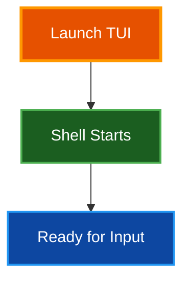

# Quick Start Guide

Get started with Par Term Emu TUI Rust in under 5 minutes. This guide covers installation, basic configuration, and running your first terminal session.

## Table of Contents
- [Prerequisites](#prerequisites)
- [Installation](#installation)
- [First Run](#first-run)
- [Basic Configuration](#basic-configuration)
- [Essential Commands](#essential-commands)
- [Common Tasks](#common-tasks)
- [Next Steps](#next-steps)
- [Troubleshooting](#troubleshooting)
- [Related Documentation](#related-documentation)

## Prerequisites

Before installing Par Term Emu TUI Rust, ensure you have:

- **Python 3.12 or higher** - Check with `python --version`
- **uv package manager** - Install from [astral.sh/uv](https://astral.sh/uv)
- **Terminal with true color support** - Most modern terminals (iTerm2, Alacritty, Wezterm, etc.)
- **par-term-emu-core-rust** - Rust terminal emulation backend (automatically installed as dependency)

## Installation

### Quick Install

Install the TUI and all dependencies in one command:

```bash
# Clone the repository
git clone https://github.com/paulrobello/par-term-emu-tui-rust.git
cd par-term-emu-tui-rust

# Install dependencies
uv sync
```

### Post-Installation Setup

Install recommended components for enhanced functionality:

```bash
# Install all components (recommended)
par-term-emu-tui-rust install all
```

This installs:
- **Terminfo definition** - Optimal terminal compatibility
- **Shell integration** - Enhanced features (working directory tracking, prompt navigation)
- **Hack font** - For screenshot support

> **📝 Note:** You can also install components individually. See [Installation Guide](INSTALLATION.md) for details.

## First Run

Launch the TUI in your default shell:

```bash
# Using make (recommended)
make run

# Using uv run
uv run par-term-emu-tui-rust

# Using short alias
uv run ptr
```

You should see a terminal interface with:
- Welcome message and examples
- ANSI color demonstrations
- Interactive shell prompt



## Basic Configuration

### Create Default Configuration

Generate a configuration file with recommended settings:

```bash
# Create config file in XDG directory
par-term-emu-tui-rust --init-config
```

Configuration location: `~/.config/par-term-emu-tui-rust/config.yaml`

### Essential Settings

Edit your config file with these recommended settings:

```yaml
# Clipboard & Selection
auto_copy_selection: true
keep_selection_after_copy: true

# Scrollback
scrollback_lines: 10000

# Theme (use lowercase with hyphens)
theme: "dark-background"

# Notifications
show_notifications: true
notification_timeout: 5

# Screenshots
screenshot_format: "png"
screenshot_directory: null  # Auto-detect best location
```

> **✅ Tip:** Theme names in config.yaml use lowercase with hyphens (e.g., `dark-background`). The `--list-themes` command displays them with title case and spaces for readability (e.g., "Dark Background").

## Essential Commands

### Key Bindings

| Keys | Action |
|------|--------|
| **Ctrl+Shift+Q** | Quit application |
| **Ctrl+Shift+S** | Take screenshot |
| **Ctrl+Shift+C** | Copy selection |
| **Ctrl+Shift+PageUp/Down** | Scroll history one page |
| **Shift+Home / Shift+End** | Jump to top / bottom of scrollback |

### Mouse Actions

| Action | Result |
|--------|--------|
| **Shift + Click & Drag** | Select text character-by-character |
| **Double-Click** | Select word |
| **Double-Click + Drag** | Extend selection by words |
| **Triple-Click** | Select line |
| **Triple-Click + Drag** | Extend selection by lines (up/down) |
| **Ctrl + Click URL** | Open URL in browser |
| **Mouse Wheel** | Scroll history (when mouse tracking off) |
| **Middle Click** | Paste PRIMARY selection (Linux) or clipboard (macOS/Windows) |

## Common Tasks

### Change Theme

**Temporary (session only):**
```bash
# Use theme for this session (use display name from --list-themes)
par-term-emu-tui-rust --theme "Solarized Dark"
```

**Permanent:**
```bash
# Apply theme to config file (use display name)
par-term-emu-tui-rust --apply-theme "Solarized Dark"
```

**List available themes:**
```bash
par-term-emu-tui-rust --list-themes
# Or using make
make themes
```

> **📝 Note:** Available themes include Dark Background, High Contrast, Light Background, Pastel (Dark Background), Regular, Smoooooth, Solarized, Solarized Dark, Solarized Light, Tango Dark, Tango Light, and iTerm2 Dark. Use the exact display names shown by `--list-themes` for CLI flags, while config.yaml uses lowercase with hyphens (e.g., `solarized-dark`).

### Take Screenshots

**Manual screenshot:**
- Press **Ctrl+Shift+S** during session
- Files saved to screenshot directory (configurable) or auto-detected location
- Timestamped filename: `terminal_screenshot_YYYYMMDD_HHMMSS.png`

**Automated screenshot:**
```bash
# Screenshot after 3 seconds, quit after 5
par-term-emu-tui-rust --screenshot 3 --auto-quit 5
```

**Change format:**
```yaml
# In config.yaml
screenshot_format: "svg"  # Options: png, jpeg, bmp, svg, html
```

> **📝 Note:** Screenshots are saved with timestamped filenames. The directory location can be configured with `screenshot_directory` in config.yaml, or will auto-detect the best location (e.g., `~/Pictures/Screenshots` on macOS, `~/Pictures` on Linux, or current working directory as fallback).

### Display Graphics

The terminal supports inline graphics using Sixel, Kitty, and iTerm2 protocols:

**Display images with Sixel:**
```bash
# Using the included utility script
uv run python scripts/display_image_sixel.py path/to/image.png

# Scale image to 50% size
uv run python scripts/display_image_sixel.py path/to/image.png --scale 0.5

# Specify terminal size in characters
uv run python scripts/display_image_sixel.py path/to/image.png --width 80 --height 24
```

**Test Kitty graphics animations:**
```bash
# Run animation demo (creates red/blue and color cycle animations)
uv run python scripts/test_kitty_animation.py
```

**Use standard graphics tools:**
```bash
# Using viu (Sixel/Kitty image viewer)
viu image.png

# Using chafa (multi-protocol image viewer)
chafa image.png

# Using img2sixel (if libsixel installed)
img2sixel image.png
```

> **📝 Note:** Graphics are rendered using Unicode half-blocks (▀) for 2:1 vertical compression. They scroll with text and are preserved in scrollback history. Kitty animations update automatically at ~60Hz.

### Custom Shell

Run with a specific shell:

```bash
# Use zsh
par-term-emu-tui-rust --shell /bin/zsh

# Use fish
par-term-emu-tui-rust --shell /usr/bin/fish

# Run specific command
par-term-emu-tui-rust --command "neofetch"
```

### Enable Debug Logging

```bash
# Enable Python TUI debug logging to timestamped file
par-term-emu-tui-rust --debug
# Logs location: debug_logs/terminal_debug_YYYYMMDD_HHMMSS.log

# Or use make commands for comprehensive debugging
make debug           # DEBUG_LEVEL=2 (info) + Python logs
make debug-verbose   # DEBUG_LEVEL=3 (debug) + Python logs
make debug-trace     # DEBUG_LEVEL=4 (trace - HUGE logs!)
make debug-tail      # Tail Rust + Python logs in real-time
make debug-view      # View logs with less
make debug-clear     # Clear all debug logs
```

**Debug Log Locations:**
- Python TUI logs: `debug_logs/terminal_debug_YYYYMMDD_HHMMSS.log` (when using `--debug`)
- Rust backend logs: `<TEMP_DIR>/par_term_emu_core_rust_debug_rust.log` (when using `make debug*` with DEBUG_LEVEL)
- Python backend logs: `<TEMP_DIR>/par_term_emu_debug_python.log` (when using `make debug*` with DEBUG_LEVEL)

Where `<TEMP_DIR>` is:
- macOS: `/tmp`
- Linux: `/tmp`
- Windows: System temp directory

> **📝 Note:** The `--debug` flag creates timestamped Python logs in `debug_logs/`, while `make debug*` commands set DEBUG_LEVEL environment variable to enable Rust backend logging to the system temp directory.

## Next Steps

### Learn More Features

Explore advanced features:
- **Graphics Protocol** - Sixel, Kitty, and iTerm2 inline images with animation support
- **Interactive Configuration** - Tabbed UI with widget-based and raw YAML editing modes
- **Session Recording** - Record terminal sessions to asciicast or JSON with auto-export
- **Scrollback buffer** - Navigate terminal history efficiently (graphics scroll with text)
- **Hyperlink support** - Click URLs (OSC 8 and plain text)
- **Notifications** - Terminal application notifications (OSC 9/777) with toast messages
- **Shell Integration** - Working directory tracking, prompt navigation, command statistics
- **Cursor styles** - Blinking and steady cursor modes
- **Mouse support** - Full mouse tracking for applications
- **KITTY Keyboard Protocol** - Enhanced keyboard handling with auto-detection
- **Color System** - Bold brightening and automatic contrast adjustment (iTerm2-compatible)

See [Features](FEATURES.md) and [README](../README.md) for comprehensive feature documentation.

### Customize Your Setup

**Create custom theme:**
```bash
# Export current theme to custom file
par-term-emu-tui-rust --export-theme my-theme
# Creates: ~/.config/par-term-emu-tui-rust/themes/my-theme.yaml

# Edit the YAML file to customize colors
# See THEMES.md for theme structure

# Apply your custom theme from file
par-term-emu-tui-rust --apply-theme-from ~/.config/par-term-emu-tui-rust/themes/my-theme.yaml
```

> **✅ Tip:** See [Themes Guide](THEMES.md) for detailed theme customization instructions.

**Configure shell integration:**
```bash
# Install for current shell (auto-detected)
par-term-emu-tui-rust install shell-integration

# Install for all available shells
par-term-emu-tui-rust install shell-integration --all

# Install for specific shell
par-term-emu-tui-rust install shell-integration zsh

# Restart shell to activate
exec $SHELL
```

Shell integration provides:
- Current directory tracking (OSC 7)
- Prompt navigation
- Command status tracking

> **📝 Note:** Shell integration files are installed to `~/.config/par-term-emu-tui-rust/shell-integration/` and must be sourced in your shell config.

### Extend the TUI

**For Developers:**
- [Architecture](ARCHITECTURE.md) - Comprehensive system design and implementation details
- [Contributing](../CONTRIBUTING.md) - Development setup and contribution guidelines
- [Debug Guide](DEBUG.md) - Debugging tools and techniques
- [CLAUDE.md](../CLAUDE.md) - AI assistant instructions for working with this codebase

## Troubleshooting

### TUI Won't Start

**Check Python version:**
```bash
python --version
# Should be 3.12 or higher
```

**Reinstall dependencies:**
```bash
uv sync
```

### Colors Not Displaying

**Verify terminal support:**
```bash
# Check TERM variable
echo $TERM

# Test true color
printf "\x1b[38;2;255;100;0mTRUECOLOR\x1b[0m\n"
```

**Set TERM variable:**
```bash
export TERM=xterm-256color
```

### Shell Integration Not Working

**Verify installation:**
```bash
# Check installation files exist
ls ~/.config/par-term-emu-tui-rust/shell-integration/
```

**Re-install shell integration:**
```bash
par-term-emu-tui-rust install shell-integration --all
exec $SHELL
```

### Screenshots Failing

**Install Hack font for PNG/JPEG/BMP screenshots:**
```bash
par-term-emu-tui-rust install font
```

> **📝 Note:** SVG and HTML screenshot formats do not require font installation.

**Check screenshot directory permissions:**
```bash
# Verify write access to screenshot directory
# Location depends on config and OS (e.g., ~/Pictures/Screenshots on macOS)
touch ~/Pictures/Screenshots/test.txt && rm ~/Pictures/Screenshots/test.txt
```

### Performance Issues

**Reduce scrollback buffer:**
```yaml
# In config.yaml
scrollback_lines: 1000  # Default is 10000
```

**Cursor blinking is already disabled by default:**
```yaml
# In config.yaml
cursor_blink_enabled: false  # Default setting
```

**Adjust mouse wheel scroll speed:**
```yaml
# In config.yaml
mouse_wheel_scroll_lines: 1  # Default value
```

> **✅ Tip:** See [TROUBLESHOOTING.md](TROUBLESHOOTING.md) for more performance optimization tips.

## Related Documentation

- [README](../README.md) - Complete project overview and feature documentation
- [Installation Guide](INSTALLATION.md) - Detailed installation instructions
- [Usage Guide](USAGE.md) - Command-line options and workflows
- [Configuration Reference](CONFIG_REFERENCE.md) - All 57 configuration options
- [Features](FEATURES.md) - Comprehensive feature descriptions
- [Key Bindings](KEY_BINDINGS.md) - Keyboard shortcuts and mouse actions
- [Themes Guide](THEMES.md) - Theme system and 12 built-in themes
- [Screenshots Guide](SCREENSHOTS.md) - Screenshot functionality
- [KITTY Protocol](KEYBOARD_PROTOCOL.md) - Enhanced keyboard protocol
- [Architecture](ARCHITECTURE.md) - System design and implementation
- [Debug Guide](DEBUG.md) - Debugging tools and techniques
- [Troubleshooting](TROUBLESHOOTING.md) - Common issues and solutions
- [Contributing](../CONTRIBUTING.md) - Development setup and guidelines
- [Documentation Style Guide](DOCUMENTATION_STYLE_GUIDE.md) - Contributing to docs

## Summary

You're now ready to use Par Term Emu TUI Rust! This quick start covered:

1. **Installation** - Set up the TUI and dependencies
2. **Configuration** - Created and customized config file
3. **Essential commands** - Key bindings and mouse actions
4. **Common tasks** - Themes, screenshots, and shell customization

For advanced features and comprehensive documentation, explore the guides in the [Related Documentation](#related-documentation) section above.

> **✅ Tip:** Join the discussion at [GitHub Discussions](https://github.com/paulrobello/par-term-emu-tui-rust/discussions) to ask questions and share tips!
