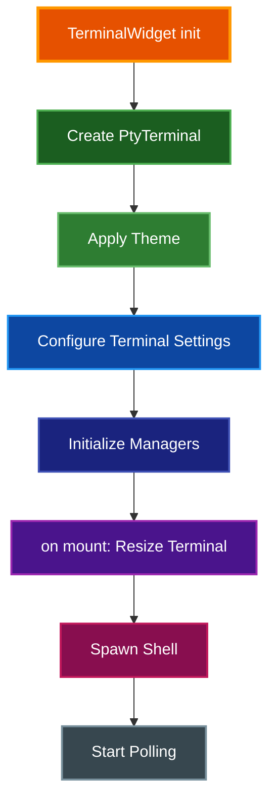

# Theme System

Complete guide to color themes in par-term-emu-tui-rust, including built-in themes, customization, and creating your own themes.

## Table of Contents
- [Overview](#overview)
- [Using Themes](#using-themes)
  - [Setting a Theme](#setting-a-theme)
  - [Listing Available Themes](#listing-available-themes)
- [Built-in Themes](#built-in-themes)
  - [Dark Themes](#dark-themes)
  - [Light Themes](#light-themes)
  - [Specialty Themes](#specialty-themes)
- [Theme Anatomy](#theme-anatomy)
- [Creating Custom Themes](#creating-custom-themes)
  - [Custom Theme Location](#custom-theme-location)
  - [Theme File Format](#theme-file-format)
  - [Example Custom Theme](#example-custom-theme)
- [Theme Application](#theme-application)
- [Related Documentation](#related-documentation)

## Overview

The theme system provides complete control over terminal colors, including:
- 16 ANSI palette colors (8 standard + 8 bright variants)
- Default background and foreground colors
- Cursor, selection, and UI element colors
- Support for custom user-defined themes

Themes are applied **before the shell starts**, ensuring consistent colors from the first prompt.

## Using Themes

### Setting a Theme

**Via Configuration File:**

Edit `~/.config/par-term-emu-tui-rust/config.yaml`:

```yaml
theme: "dark-background"  # Default theme
```

**Via Command Line:**

```bash
# Use a specific theme for one session (overrides config)
par-term-emu-tui-rust --theme solarized-dark

# Apply a built-in theme to config.yaml permanently
par-term-emu-tui-rust --apply-theme iterm2-dark

# Import and apply a custom theme from a YAML file
par-term-emu-tui-rust --apply-theme-from ~/mytheme.yaml

# Export current theme to a YAML file
par-term-emu-tui-rust --export-theme my-custom-theme
```

### Listing Available Themes

```bash
# List all built-in themes
par-term-emu-tui-rust --list-themes

# Or via make
make themes
```

## Built-in Themes

The terminal includes 12 built-in themes across dark, light, and specialty categories. Each theme provides a complete color palette with 16 ANSI colors plus UI element colors.

### Dark Themes

#### Dark Background
**Key:** `dark-background`

Traditional dark terminal with black background and standard ANSI colors. This is the default theme.

- **Background:** `#000000` (Black)
- **Foreground:** `#bbbbbb` (Gray)
- **Best for:** General use, compatibility

#### iTerm2 Dark
**Key:** `iterm2-dark`

Classic iTerm2-style color scheme with pure black background and vibrant custom palette. Perfect for OLED displays and users who prefer deep blacks.

- **Background:** `#000000` (Pure black)
- **Foreground:** `#b2b2b2` (Light gray)
- **Palette:** Custom vibrant color scheme
- **Best for:** OLED displays, dark environment, vibrant colors

#### Tango Dark
**Key:** `tango-dark`

Tango color scheme with dark gray background (softer than pure black).

- **Background:** `#2e3436` (Dark gray)
- **Foreground:** `#d3d7cf` (Light gray)
- **Palette:** Official Tango colors
- **Best for:** Reduced eye strain, non-OLED displays

#### Solarized Dark
**Key:** `solarized-dark`

Ethan Schoonover's carefully designed low-contrast dark theme.

- **Background:** `#002b36` (Dark blue-gray)
- **Foreground:** `#839496` (Gray-blue)
- **Best for:** Long coding sessions, color consistency

#### Pastel (Dark Background)
**Key:** `pastel-dark`

Soft pastel colors on dark background.

- **Background:** `#000000` (Black)
- **Foreground:** `#bbbbbb` (Gray)
- **Palette:** Muted pastels
- **Best for:** Aesthetic preference, softer visual experience

#### Smoooooth
**Key:** `smoooooth`

Smooth, muted colors optimized for extended use.

- **Background:** `#15191f` (Very dark blue-gray)
- **Foreground:** `#dcdcdc` (Light gray)
- **Best for:** Minimal eye strain, elegant appearance

### Light Themes

#### Light Background
**Key:** `light-background`

Classic light terminal colors.

- **Background:** `#ffffff` (White)
- **Foreground:** `#000000` (Black)
- **Best for:** Bright environments, high ambient light

#### Tango Light
**Key:** `tango-light`

Tango color scheme optimized for light backgrounds.

- **Background:** `#ffffff` (White)
- **Foreground:** `#2e3436` (Dark gray)
- **Best for:** Daytime use, outdoor work

#### Solarized Light
**Key:** `solarized-light`

Light variant of Solarized with the same color relationships.

- **Background:** `#fdf6e3` (Cream)
- **Foreground:** `#657b83` (Blue-gray)
- **Best for:** Consistent colors with Solarized Dark

### Specialty Themes

#### High Contrast
**Key:** `high-contrast`

Maximum contrast for accessibility.

- **Background:** `#000000` (Pure black)
- **Foreground:** `#ffffff` (Pure white)
- **Colors:** Bright, saturated ANSI colors
- **Best for:** Visual accessibility, presentations

#### Regular
**Key:** `regular`

Balanced colors for general terminal use.

- **Background:** `#fafafa` (Very light gray)
- **Foreground:** `#101010` (Very dark gray)
- **Best for:** Moderate contrast preference

#### Solarized
**Key:** `solarized`

Original Solarized base theme.

- **Background:** `#002b36` (Dark blue-gray)
- **Foreground:** `#839496` (Gray-blue)
- **Best for:** Solarized purists

## Theme Anatomy

Each theme consists of these color components:

```yaml
# ANSI Palette (16 colors)
palette:
  - "#2e3436"  # Black (Color 0)
  - "#cc0000"  # Red (Color 1)
  - "#4e9a06"  # Green (Color 2)
  - "#c4a000"  # Yellow (Color 3)
  - "#3465a4"  # Blue (Color 4)
  - "#75507b"  # Magenta (Color 5)
  - "#06989a"  # Cyan (Color 6)
  - "#d3d7cf"  # White (Color 7)
  - "#555753"  # Bright Black (Color 8)
  - "#ef2929"  # Bright Red (Color 9)
  - "#8ae234"  # Bright Green (Color 10)
  - "#fce94f"  # Bright Yellow (Color 11)
  - "#729fcf"  # Bright Blue (Color 12)
  - "#ad7fa8"  # Bright Magenta (Color 13)
  - "#34e2e2"  # Bright Cyan (Color 14)
  - "#eeeeec"  # Bright White (Color 15)

# Default Colors
background: "#2e3436"      # Default background
foreground: "#d3d7cf"      # Default text color

# Cursor Colors
cursor: "#d3d7cf"          # Cursor color
cursor_text: "#2e3436"     # Text inside cursor (reverse video)

# Selection Colors
selection: "#eeeeec"       # Selection background
selection_text: "#555753"  # Selected text color

# UI Colors
link: "#729fcf"            # Hyperlink color
bold: "#eeeeec"            # Bold text color override
cursor_guide: "#555753"    # Cursor column guide
underline: "#d3d7cf"       # Underline color override
badge: "#cc0000"           # Badge/notification color
match: "#fce94f"           # Search match highlight
```

## Creating Custom Themes

### Custom Theme Location

When you import a custom theme using `--apply-theme-from`, it is saved to:

```
~/.config/par-term-emu-tui-rust/themes/
```

Each theme is stored as a separate YAML file named `{theme-name}.yaml`.

**Important Limitation:** Custom themes are currently **not fully supported**. While `--apply-theme-from` saves the theme file and updates your config, the application only loads built-in themes. To use a custom theme, it must be added to the built-in themes in `src/par_term_emu_tui_rust/themes.py`. Support for loading custom themes from the themes directory is planned for a future release.

### Theme File Format

Create a YAML file with all required color fields:

```yaml
name: "My Custom Theme"

palette:
  - "#hexcolor"  # 16 colors required (0-15)
  # ... (must have exactly 16 colors)

background: "#hexcolor"
foreground: "#hexcolor"
cursor: "#hexcolor"
cursor_text: "#hexcolor"
selection: "#hexcolor"
selection_text: "#hexcolor"
link: "#hexcolor"
bold: "#hexcolor"
cursor_guide: "#hexcolor"
underline: "#hexcolor"
badge: "#hexcolor"
match: "#hexcolor"
```

### Example Custom Theme

**File:** `~/.config/par-term-emu-tui-rust/themes/nord-inspired.yaml`

```yaml
name: "Nord Inspired"

palette:
  - "#3b4252"  # Black
  - "#bf616a"  # Red
  - "#a3be8c"  # Green
  - "#ebcb8b"  # Yellow
  - "#81a1c1"  # Blue
  - "#b48ead"  # Magenta
  - "#88c0d0"  # Cyan
  - "#e5e9f0"  # White
  - "#4c566a"  # Bright Black
  - "#d08770"  # Bright Red
  - "#a3be8c"  # Bright Green
  - "#ebcb8b"  # Bright Yellow
  - "#81a1c1"  # Bright Blue
  - "#b48ead"  # Bright Magenta
  - "#8fbcbb"  # Bright Cyan
  - "#eceff4"  # Bright White

background: "#2e3440"
foreground: "#d8dee9"
cursor: "#d8dee9"
cursor_text: "#2e3440"
selection: "#4c566a"
selection_text: "#eceff4"
link: "#88c0d0"
bold: "#eceff4"
cursor_guide: "#4c566a"
underline: "#d8dee9"
badge: "#bf616a"
match: "#ebcb8b"
```

**Current Limitation:**

After importing a custom theme with `--apply-theme-from`, the theme file is saved to `~/.config/par-term-emu-tui-rust/themes/` but cannot be loaded by the application. The theme system currently only supports the 12 built-in themes.

```bash
# This does NOT work - custom themes cannot be loaded yet
par-term-emu-tui-rust --theme nord-inspired  # ❌ Will fail

# Only built-in theme keys work
par-term-emu-tui-rust --theme iterm2-dark    # ✓ Works
```

**Workarounds:**

Until custom theme loading is implemented, you can:

1. **Export and modify a built-in theme:** Use `--export-theme` to create a custom theme file, modify it, then add it to `src/par_term_emu_tui_rust/themes.py`
2. **Contribute:** Submit a PR to add your theme as a new built-in theme for all users

The `--apply-theme-from` command validates and saves the theme file structure for future use, but the application's theme loader (`get_theme()` function in `themes.py`) only searches the built-in `THEMES` dictionary, not the user themes directory. The saved theme files in `~/.config/par-term-emu-tui-rust/themes/` will be ready to use once custom theme loading support is implemented.

## Theme Application

Themes are applied early in the widget initialization lifecycle to ensure correct colors from the very first prompt:



### Application Flow

**Initialization Phase (`__init__`):**
1. Create PtyTerminal instance with configured dimensions
2. **Apply theme colors** using `theme_manager.apply_theme()`
   - Sets all 16 ANSI palette colors
   - Sets default foreground and background
   - Sets cursor, selection, link colors
   - Sets special UI colors (badge, match, guide)
3. Configure terminal feature settings (clipboard, OSC 7, security)
4. Initialize managers (selection, clipboard, screenshot, renderer)

**Mount Phase (`on_mount`):**
1. Resize terminal to match actual widget size
2. **Spawn shell process** (theme already applied)
3. Start update polling timer

**Key Points:**
- Theme is applied **before shell spawns** - ensures correct colors from first prompt
- Theme colors are set on PtyTerminal, not on the renderer
- Renderer reads colors from PtyTerminal for each cell
- Widget background automatically matches theme background

### Cell Rendering Logic

The renderer uses this priority when determining cell colors:

1. **Explicit cell color** - If cell has a specific color set by terminal application
2. **Theme default** - If cell has no explicit color, use theme's default colors
3. **Minimum contrast** - If enabled in config, adjust colors for readability

This ensures:
- Theme backgrounds work correctly
- Applications can override colors when needed
- Text remains readable with minimum_contrast setting

## Related Documentation

- [Configuration Reference](CONFIG_REFERENCE.md) - All configuration options including theme setting
- [Quick Start Guide](QUICK_START.md) - Getting started with the terminal
- [Usage Guide](USAGE.md) - Command-line options and flags
